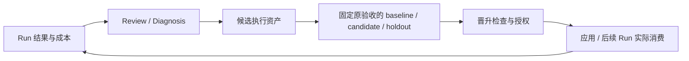

# Singularity 架构评估：CosyVoice graph4 的收益、复杂度与 RSI 边界

评估日期：2026-10-06，Asia/Shanghai。现场快照时间：13:17:42。研究对象为 graph4 / `bb-cosyvoice-fullstack-r3`，Task store `sg-t-0663b378-ecc5-46f0-a395-177624bc06f9`，root Task `t-c07d1494-7083-4e71-8224-def2de2ab98a`。

源码基线：Singularity 独立 Git 仓库 `fa7c5999bbf9467731cabea87bb9ed2e60b23355`，研究开始时干净；外层 Harness `c525f427bfea015c018b1d83782f4cfb3965085d`。外层存在部署 skill 的未跟踪文件和 `.dsh/skills` 子模块变动，本次保留。实际配置是 [harness/config.yml](/home/ROXY/code/bb_work/harness/config.yml:114)，此现场没有 `.dsh/config.yml`；启动器从根目录配置读取。本次没有修改运行时代码、任务合同、模板、checker、技能或运行状态，没有重启服务。

## 1. 判断

**Singularity 已能实质性帮助复杂工程任务，但当前实现和部署还不足以同时称为简洁、高效、可用的 RSI 系统。应保留任务契约、执行绑定和验证证据这条主线，优先修复验收与恢复的断裂，随后压低上下文和调度成本。**

| 问题 | 判断 | 依据及范围 |
| --- | --- | --- |
| 核心思想是否简洁 | 是 | Task 固定目标，Run 固定一次执行与能力，Session 承载工作，Verifier 按契约裁决；Task 树与消费依赖分开表达。 |
| 当前整体是否够简洁 | 尚不足 | 13 个包、229 个 `src/*.ts(x)` 文件、52,701 行；关键跨包路径仍有契约不一致。规模本身不证明过度设计，真正的问题是操作方必须掌握这些接线细节才能正常运行。 |
| 是否高效 | 局部优化有效，整体收益未证实，已有明显限制 | 单 checkout 单写者加串行 batch；完整 guidance 注入；调用预算事后检查；没有同目标、同模型的基线对照。不能把硬件仿真耗时全部归因于平台。 |
| 是否实质性帮助 agent | 是 | 真实递归到 depth 2；4 个中间节点 composite 收口；7 组父子问答全部解决；重启后保留身份与既有结果继续工作。 |
| 是否有 RSI 能力 | 有受控资产改进机制；本部署没有可用、已验证的闭环 | 源码支持候选、双侧实验、晋升、应用、回滚及新 Run；graph4 无实验，且所有现存 Task 都缺实验必需的 verifier pin。没有反复自主提升改进器自身的证据。 |

本报告将 RSI 定义为：从执行反馈发现可复用方法的缺陷，修改自身执行资产，以固定原验收和独立样本检验改进，应用后由后续真实任务消费，并可再次执行这条改进链。递归分解、一次任务内调试、保存提案或生成 skill，均不能独自证明 RSI。人审与 RSI 不矛盾，但人审自动通过也不证明全自治或效果可靠。

## 2. 研究方法与现场事实

先读 [完整进展日志](/home/ROXY/code/bb_work/cv-fullstack-run-2026-10-05/evidence/progress-log.md:1)，再用 Web UI 所消费的 `/singularity/task`、`graph`、`graphs`、`recovery`、`evolution`、`hitl` 只读 API 核对现场，最后对照源码、运行绑定和原始产物。没有把日志叙述直接当成当前源码事实，也没有以界面颜色推断工程质量。关键快照、统计、产物摘要和隔离反例保存在 [研究证据 JSON](/home/ROXY/code/bb_work/harness/packages/singularity/docs/2026-10-06-cosyvoice-architecture-evidence.json:1)；Evolution 专项源码审计见 [RSI 审计](/home/ROXY/code/bb_work/harness/packages/singularity/docs/2026-10-06-rsi-source-audit.md:1)。

| 现场量 | 13:17:42 的观测 |
| --- | --- |
| Task / Run / Review / Diagnosis | 31 / 26 / 23 / 0 |
| Task 状态 | verified 23，running 3，admitted 5 |
| 深度 | d0 1，d1 7，d2 23；19 个 d2 叶已 verified |
| 已结算判据 | pass 34，inconclusive 18 |
| 父子问题 | 7 条，全部有 resolves=true 的回答，首次回答延迟 16.4–220.6 秒 |
| 模板 | 部署库 35 条；当前 Task 显式引用 9 个不同模板；库外自撰任务也获准执行 |
| Evolution | 全局 5 proposals、0 experiments；5 条 sourceRefs 均不属于 graph4 |
| root | running / waiting_children，完整业务验收尚未成功结算 |

`final-report.md` 当前记录的是 graph3 的 BLOCKED-SETUP，不能当作 graph4 的最终报告。`tamper-matrix.txt` 是独立验收夹具红测，T0/T4 通过不意味着 graph4 已通过 AC-1。来源：[旧阶段报告](/home/ROXY/code/bb_work/cv-fullstack-run-2026-10-05/final-report.md:3)、[红测矩阵](/home/ROXY/code/bb_work/cv-fullstack-run-2026-10-05/evidence/tamper-matrix.txt:1)。

## 3. 已经实现的帮助

**任务与能力分离解决了真实装配问题。** graph3 的根声明所有执行能力，绑定 7 份 guidance，正文共 50,152 字节，单 skill 正文就超过 50,000 字节上限。graph4 将 root 与协调节点绑定为一份 3,211 字节的 `bb-orchestrator`，叶节点再取执行能力，随后正常分解和执行。这是合理的模块责任分离。收益来自平台绑定机制与部署 skill 重构共同作用，不能全归功于运行时自动选择。来源：[装配失败](/home/ROXY/code/bb_work/cv-fullstack-run-2026-10-05/evidence/progress-log.md:102)、[r3 绑定](/home/ROXY/code/bb_work/cv-fullstack-run-2026-10-05/evidence/progress-log.md:159)、[协调技能](/home/ROXY/code/bb_work/harness/environment/project4/.agents/skills/bb-orchestrator/SKILL.md:8)。

**分解、交接和问答确实改变了工程执行。** 四个 d1 节点在子结果之后做 composite 和自身命令验收；Verilator 叶发现完整带波形运行的磁盘及时间约束后，向父节点询问范围，得到答复再执行两阶段分区和取证。平台提供了可追溯决策通路。此处是 Task Question 的反馈闭环，Diagnosis 表仍为零，不能称 supervisor 已诊断并修复。来源：[父子问答](/home/ROXY/code/bb_work/cv-fullstack-run-2026-10-05/evidence/progress-log.md:450)、[批后归还执行权](/home/ROXY/code/bb_work/harness/packages/singularity/task-runtime/src/orchestration/batch.ts:150)。

**结果和恢复具有实际可追溯性。** 本次重新计算 BEMU 与 Verilator 分区组装输出的 sha256，两份均为 `1b3232012de12fd8b0e82577843c011e333fe35080f7f7e4d67d72dbf5fd0b91`，每份 123,269 字节；位证明文件包含 12,800 元素一致的记录。这说明交付已包含可独立复核的工程结果。它不等于已证明整芯片 PPA、所有边界或单次 canonical RTL 全运行通过，也不替代对分区等价论证的完整审核。来源：[BEMU 输出](/home/ROXY/code/bb_work/harness/environment/project4/log/hibiki-model-compare/prelookahead_out.bemu.cv2.txt:1)、[RTL 输出](/home/ROXY/code/bb_work/harness/environment/project4/log/hibiki-ev/verilator/prelookahead_out.verilator.cv2.txt:1)、[位证明](/home/ROXY/code/bb_work/harness/environment/project4/log/hibiki-ev/verilator/raw/p2-bitproof.json:1)。

机器重启后，31 Tasks、25 Runs 和22 Reviews 被保留；预热 nix 环境并显式 select 原图后，原身份续跑，没有重派已完成任务。持久化是实质性帮助，但恢复需要外部干预。来源：[重启与恢复记录](/home/ROXY/code/bb_work/cv-fullstack-run-2026-10-05/evidence/progress-log.md:411)。

## 4. 当前最严重的问题：验收强度不足

通用 [leaf_accept.py](/home/ROXY/code/bb_work/harness/environment/project4/checks/leaf_accept.py:143) 从 env 根读取单例 `task-artifact.json`，接受任何已知 kind，只检查非空路径、若干字段、PASSED 标记；sha256 字段仅检查格式，普通值主要排除空值与占位词。它没有当前 Task/Run 身份，也没有由契约传入的 expected kind，通常不重算领域结果。

例如 [拓扑模板](/home/ROXY/code/bb_work/harness/.dsh/singularity/task-templates/bb-topology-boundary@1.json:23) 的判据声称 `kind` 必须为 `topology-boundary`，但执行命令固定为 `python3 checks/leaf_accept.py`，没有传入该预期；模板描述没有变成执行中的约束。

在 `/tmp` 隔离副本中，本次实际执行两个反例，均 **exit 0**：

1. `kind=topology-boundary`，tile/core/replica/latency 全写 `any`，仅列出一个包含无关文本的非空文件；没有容量计算或芯片拓扑。
2. 同一验收命令，改为 `kind=artifact-identity`，sha256 写 64 个零，artifact 指向无关文件；没有计算摘要，也没有拓扑产物。

输入和完整输出已保存在研究证据 JSON。没有向 live store 提交这些反例，也没有改变任何真实产物。这证明当前叶判据可以产生语义上的假阳性，**没有证明实际叶交付是伪造的**。

质量 review 无法补这个缺口：[ReviewVerifier](/home/ROXY/code/bb_work/harness/packages/singularity/verifier/src/review-verifier.ts:32) 始终返回 inconclusive；本轮相关 review 为 optional，结算仅要求 mandatory 通过，故 23 个 verified 与 18 个 inconclusive 可以同时存在。来源：[mandatory 结算](/home/ROXY/code/bb_work/harness/packages/singularity/task-runtime/src/orchestration/verify.ts:42)。当前根 AC-2 同样可选；相对原 [root-prompt 的 mandatory 质量要求](/home/ROXY/code/bb_work/cv-fullstack-run-2026-10-05/root-prompt.md:1)，这是已记录的部署口径变化，不能称原始 AC-2 已履约。

根 `cv_full_accept.py` 比叶清单验收强，红测中错误参考摘要、错误数值和替换参考分别失败；但证据主要证明数值与声明的一致性，不能从这些红测推断所有执行来源均无法伪造。平台可保护验收输入：[protectedInputs 检查](/home/ROXY/code/bb_work/harness/packages/singularity/verifier/src/index.ts:331)。目前通用模板叶判据没有 protectedInputs；业务 verifier 的输入固定和任务身份绑定还没有成为普遍保证。

**影响：** 逐层 verified 能证明机械合同通过，却未必证明目标完成；composite 只能聚合已有证据，不能为弱叶判据补足语义；未来若用这种判据训练或晋升方法，更少工具调用可能只是更少验证。独立、有效的 judge 是执行可信度和 RSI 的共同前提。

## 5. 效率与简洁性

### 5.1 DAG 尚未带来同一工作区的并行收益

[driveRounds](/home/ROXY/code/bb_work/harness/packages/singularity/task-runtime/src/orchestration/child.ts:560) 选择第一个依赖满足的 pending Task，启动后 await 到该轮结束，再找下一个；[workspace ownership](/home/ROXY/code/bb_work/harness/packages/singularity/task-runtime/src/workspace.ts:259) 则保护同 checkout 的单写者。依赖 DAG 用于顺序与失败传播，不能据图的分叉理解为 worker 并行。

快照中 PPA 叶没有显式入边，却与 target-build 等叶一起等待长 Verilator 工作结束。本例存在调度层面的队头阻塞；是否能安全重叠 PPA，还要分析编译、配置与输出目录的真实冲突，不能直接删锁或 Promise.all。叶内部曾并行运行 11 路仿真，证明的是叶调用外部工具的并行，未证明平台任务调度并行。

### 5.2 小 skill 有效，但完整正文注入仍是脆弱点

[contractProjection](/home/ROXY/code/bb_work/harness/packages/singularity/context/src/reads/contract.ts:127) 将每份已绑定 skill 的完整正文放入不可裁剪的契约上下文；[50KB 上限](/home/ROXY/code/bb_work/harness/packages/singularity/context/src/limits.ts:11) 仍硬编码。多能力组合依然可能在准入成功之后、模型请求之前崩溃。错误提示让 agent 分页读取，在 agent 已无法收到模型输入时没有可执行性。应在激活前预检可装配性，并缩小必需 guidance，资源通过已有引用按需读；不靠无限提高上限掩盖问题。

还有历史修复与当前源码的差异：日志曾记录 `literalContextText` 修复插值；当前 [withRuntimeContext](/home/ROXY/code/bb_work/harness/packages/singularity/context/src/assembly.ts:70) 及编译 lib 均直接传入文本，上游 [renderContextSections](/home/ROXY/code/bb_work/harness/thirdparty/deepseek-harness/packages/core/system-prompt/src/index.ts:318) 对所有 context 做严格插值。本次向实际生产渲染函数传入 `verify {{artifact}}`，复现 unknown prompt variable。graph4 的模板库去掉了 `{{...}}`，所以未再次触发；不能据此断言任意任务、问答或证据文本的插值边界已经修好。合同 section 的 `interpolate:false` 已正确设置，与 runtime context 是两个路径。

### 5.3 成本可观察，尚未形成有效控制

23 个已完成 Run 的 Review.metrics 记录合计：2,807 工具调用、5,949,840 uncached input tokens、2,288,506 output tokens、429,071,232 cache-read tokens。只合计已完成会话，未计仍在运行的 root/父/target-build 和外部编排。缓存读是累计处理量，不能当成独立文本大小或同价计费；没有模型价格、完整模型调用和对照组，本报告不估算美元成本，也不从绝对值推断全部都是平台浪费。

Verilator 叶记录 691 工具调用，高于部署 600；[预算检查](/home/ROXY/code/bb_work/harness/packages/singularity/task-runtime/src/orchestration/settlement.ts:164) 在终态时记 anomaly，未阻止超支，也未阻止 verified。它是成本注记，称“硬调用上限”会误导。该叶从 Run 开始到终态 768 分钟，包括仿真、恢复和模型等待；日志最终 campaign 为 8.66 小时，两者不是同一时间口径。

Round8 的局部调度 CPU 优化有明确数据，4096 Task 基准中的依赖投影和汇总减少重复扫描；[原报告](/home/ROXY/code/bb_work/harness/packages/singularity/docs/2026-10-05-round8-performance-review.md:30) 明确排除了快照、持久化和模型 I/O。它不能证明默认 8 个子任务或整个 CosyVoice 运行同倍数加速。每次 commit 仍 [clone state 并广播](/home/ROXY/code/bb_work/harness/packages/singularity/task/src/service/store.ts:163)，[snapshot 仍复制全状态](/home/ROXY/code/bb_work/harness/packages/singularity/task/src/service/state.ts:450)，长图尚有全量成本。

### 5.4 复杂度应按操作负担衡量

Task/Run/Session 分离、领域 capability、证据版本和故障传播都有用途，不建议为缩短代码强行合并。当前不简洁的证据是：普通 admission 与 Evolution 的 verifier 契约不同；prompt 数据进入另一套模板插值语义；无可用质量 verifier 时用户需改判据；恢复失败后用户需知道 select 才能再激活。源码全部低于 2000 行只能说明尺寸规则满足，不能证明接口足够深或运行规则容易理解。

## 6. 恢复与反馈仍有空洞

graph2 的 prompt 插值错误和 graph3 的上下文超限都让 turn 以 error 结束，但根 Run 仍 running、reviews 为零。自动扫描只消费 [failed Review，或 autoReview=all 时 verified root Review](/home/ROXY/code/bb_work/harness/packages/singularity/agent-singularity/src/coordination/review-scan.ts:48)。没有 terminal Review，就没有自动诊断来源；`recovery=ready` 只表示恢复屏障状态，不能证明业务持续推进。

应直接把可归因于绑定 Run 的 prompt/MCP/执行基础设施终止错误写成可消费的失败事实，区分 active、waiting_children、blocking question、后台作业和终止错误；不通过“多久没写日志”粗暴判定失败，也不添加无限自动重试。worker 路径已有 [whenIdle 异常捕获](/home/ROXY/code/bb_work/harness/packages/singularity/task-runtime/src/orchestration/observe.ts:38)，本报告不声称所有 worker 错误都被忽略；实际已暴露的空洞是根激活后的装配失败及跨层错误结算。

重启恢复的 MCP 握手失败会阻断 store 执行；[assertRecoveryReady](/home/ROXY/code/bb_work/harness/packages/singularity/task-runtime/src/service/root-recovery.ts:587) 明确需要 explicit activation 再试，[启动/选择图](/home/ROXY/code/bb_work/harness/packages/singularity/graphs/src/index.ts:98) 提供入口。应让 UI 明确呈现失败原因和“原图重试恢复”，现有持久身份无需改动。

## 7. RSI：有真实机制，但本次部署入口尚未闭合

源码已支持 task_definition、skill、capability 等候选资产、真实两侧执行、独立 holdout、漂移检查、受控应用/回滚和后续 Run 归属。这些是可用自改进机制的实质基础。历史 xv6 实跑曾完成模板改进链和后续 root 消费，且真实 grader 从 69/70 到 70/70；同一 [历史证据审计](/home/ROXY/code/bb_work/harness/packages/singularity/docs/2026-10-05-round8-performance-review.md:5) 说明它预置了参考内核修复，证明协调模板改善，不证明模型自主完成内核优化或改进成本回本。

**graph4 不只是“暂时没发生 Evolution”：当前全部样本在入口上都不合格。** 正常运行允许判据省略 verifierRef；实验冻结要求每条判据在源 Task 中显式指定注册 ID，再从 registry 冻结该实例的版本。现场 68 条判据中 67 条省略 ref，唯一显式 ref 为 root 的 `review`；全部 31 个 Task 至少有一条缺 ref。现有 terminal Task 因此均不能直接进入双侧实验。候选模板补 ref 不会修改被冻结的旧 Task。当前正确写法是 `verifierRef: "command"`，版本 `"1"` 由 registry 固定；`command@1` 是展示写法，填入 ref 会成为未知 ID。实际代码锚及已有旧图拒绝记录见 RSI 专项审计；修正应发生在新契约准入时，以明确解析出的版本固定身份，而非事后改已验收样本。

当前 23 Reviews 全部 verified child，root 尚未 verified；自动复盘因此没有符合条件的来源，Diagnosis 为零。全局 5 个提案属于旧图，其中 3 个 prepared、2 个 proposed，没有实验。它们不能证明 graph4 学到了什么或已发布什么。源码具备失败源闭环与成功 root 成本改进，并不意味着此运行已触发。

进一步限制：成功改进的机器目标主要是 tool-call-reduction，不能等同 token、金额、耗时或成功率提升；实验的子树 token 汇总还有口径缺口；不受支持的 runtime_policy/decomposition_policy 提案如果也被纳入“必须全部 applied”的恢复前置，会使建议阻断执行。这些应在宣称效率 RSI 前修正，详见专项审计。

因此本次判断分成三层：**代码存在受控执行资产改进能力；历史限定实例跑通过；graph4 当前部署尚不能由自身样本完成闭环。** 没有充分证据称平台可反复自主改进其改进算法、验证器或运行时，更没有证据称收益会递归增长。

## 8. 最小改进顺序与验证条件

| 优先级 | 改动 | 验收条件 |
| --- | --- | --- |
| P0 | 把判据绑定到具体 Task/Run、expected kind、不可变产物和领域结果；需要质量裁决的条件提供真实 verifier | 错任务产物、错误 kind、随意数据、伪摘要都失败；数值或行为正确的正例通过；optional inconclusive 在界面和报告显式保留。 |
| P0 | 在准入时固定 verifier 身份，统一普通运行和实验冻结要求 | 一份普通新建任务直接成为 replay 样本；无需回改历史 Task；换 verifier 版本或偷改原 AC 时拒绝。 |
| P0 | 根装配错误落入 Run 失败路径；准入前检查上下文装配；runtime context 正确处理 literal 数据 | 用带 `{{artifact}}` 的普通文本、多 skill 超限与 MCP 启动失败做反例：明确拒绝/失败可见，既不僵尸 running，也不靠改目标绕过。 |
| P1 | 给独立工作安排独立 checkout 与 Run 产物目录，保留冲突资源单写者 | 两个无依赖任务可同时推进，取消与恢复均不混身份、不串产物；共享 checkout 仍不冲突；通用单例 manifest 先移出共享位置。 |
| P1 | 明确成本预算执行方式，减少重复 guidance/历史上下文，统一整树成本统计 | 原 AC 成功率保持；同任务同模型比较 wall time、工具调用、uncached/output/cache tokens、外部干预与重试；超过预算在承诺的时间点产生可执行处理。 |
| P2 | 用真实问题验证一次可重复自改进，再评估是否需要扩大 Evolution 的元策略能力 | 同 graph/store：源结果 → Diagnosis → 候选 → 固定判据双侧/holdout → 应用 → 新 Run 消费 → 原 AC 与成本；再用一个未见任务复验，累计计算发现与实验成本，允许拒绝和回滚。 |

这一路径不需要先新增 memory、事件总线、incident 平台或更大的 supervisor 层级。已有 Task store、provider binding、verifier registry、workspace ownership 和 Evolution 账本足以承载首轮修复。默认路径应收敛到“目标与判据 → 绑定能力 → 执行 → 提交 → 验证”；有共享方法问题时再进入改进闭环。

## 9. 本次验证与限制

- 5 个定向 unit 文件：109 tests passed，1 个显式性能基准 skipped；覆盖 context reads/limits、scheduler、root budget、verifier registry。没有重跑全部工程仿真或 live 模型实验。
- `check-source-size`：490 文件满足每文件 2000 行；`verify-persistence`：4 event roots 匹配。这两项通过不替代架构或业务验证。
- 通用叶验收隔离反例 2 个：都得到与预期安全判别相反的 exit 0，已保存输入与输出；上游 production context 渲染的受控反例复现严格插值错误。
- 重新计算两份 BEMU/RTL 输出摘要，结果一致；没有从摘要相同推断完整硬件语义证明已经审核。
- 研究依据为一次仍在运行的复杂工程案例及源码、既有历史证据，没有受控端到端 A/B。后续现场状态可能变化，应以报告快照时间为准。

最终工程决策：**继续使用并收敛这条架构，但将“可信验收、错误可恢复、普通任务可进入改进实验”作为下一轮前置条件；在这些条件达成和对照测量完成前，不宜把当前版本描述为简洁高效且已具有完整 RSI。**
