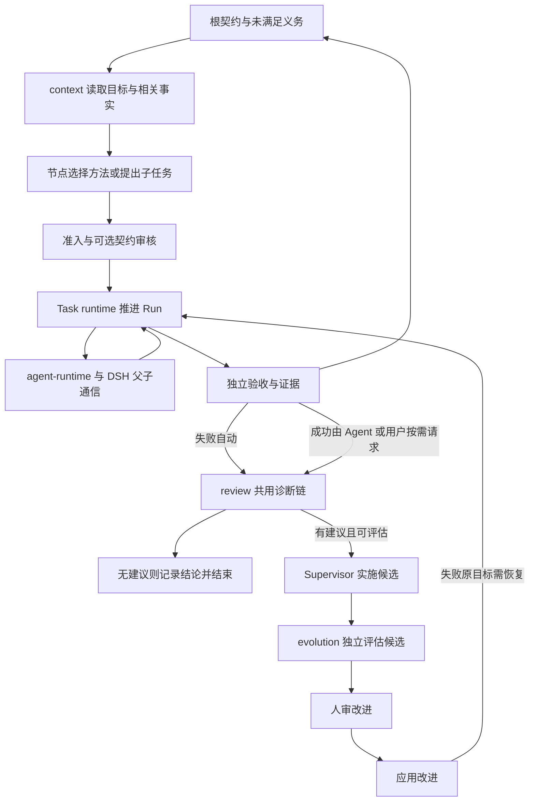

# 有目标的自由探索与受控自进化：架构实施指导

日期：2026-09-21。状态：架构决定与待建合同，不是已上线功能。基线 Singularity `9900959`，外层 harness `51b6e2f`；本地 DSH `0d1f50007f9bca3f52b06e1c3074fa14d5fb0720`。

2026-09-23 复核代码 `d5b0bb6`：A3 与 T2/T3 交付保留，A0 的来源/恢复、R2 的取消写闸、R1 的 S3 补验证已完成，R0 默认运行面证据保留；自主改进恢复仍未建。**2026-09-23 A0 返工（Q2/Q3）已关闭**：来源归属判定（store↔session、顶层会话、本人消息三规则，三入口共用，拒绝均在首次写入前）与 `adoptRoot` 公共恢复入口已落地，独立复核通过、未由人类验收；当时基线 Singularity `de85ae0`／外层 `3c4b4dbb7c`（当时工作区未提交，后已按建设计划归档）；记录见[历史执行记录](history/2026-09-24-vrtc-execution-records.md)「A0 返工（Q2/Q3）执行与验收记录」与主 guide §5.13。R2 的取消写闸（Q1）与 R1 完成轮 3 已于 2026-09-24 验收，下一项与前置以建设计划唯一表为准。以下未来字段是设计候选，不能逐字段照搬；已实现机制不等于全部入口已满足合同。

本文细化 [主指南](singularity-harness-guide.md)的上下文、协作与 supervisor 主线；Task 结构及可选契约审核见 [Task 自主构造指导](task-contract-construction-guide.md)，建设顺序见 [计划](2026-09-20-vrtc-code-change-plan.md)。外部事实及固定来源见 [开源调研](2026-09-21-open-source-agent-patterns.md)，角色提示词合同见 [Prompt 指导](agent-prompt-contracts.md)。

## 1. 要达成的行为

给定根目标，节点知道自己的任务为什么有用、需要什么证据、有哪些约束；可选择工具、复用方法或构造子任务。信息不够时先查询可追溯上下文，再询问父节点。执行结果由 verifier 判定；有能力或机制缺口时，supervisor 沿执行与证据关系定位原因、实施候选、组织对照验证，人审核改进后系统应用并恢复受影响任务。

不把成功寄托于一段万能 system prompt，也不预先规定领域步骤。运行时负责结构、权限、资源与状态不变量；模型负责方法选择、任务构造、解释和候选实现。自由不是随意修改目标，进化不是绕开验证。

## 2. 现状审计

| 问题 | 当前已经有 | 当前还没有或存在断点 |
|---|---|---|
| 子节点全局观 | fresh session；TaskHandoff 的父目标、理由、决策/约束等字段；父 session 引用；worker contract 系统投影 | 实际 `buildHandoff` 调用主要填父目标、依赖证据、assumptions，决策/约束常为空；没有完整 root brief 和祖先决策投影 |
| 压缩后契约 | `contract-reinjection.ts` 复用 DSH system prompt projection，agent scope 隔离 | 动态上下文版本、决策变更通知、事实与摘要来源分离不完整 |
| 子询问父 | DSH 有 inbox/steer/followup、continuable send_message；worker 有 ask_user_question | Singularity spawn 直接走 agents.create，未注册 continuable activation；开放 send_message 不能自动得到子到父通道（A4 已交付 2026-09-25、冷恢复返工闭合 2026-09-26：`task_ask_parent`/`task_answer`、持久 questionId/答复/等待协议与同 messageId 投递；send_message 仍未开放） |
| 父节点可回答 | A3 已使 `decomposeAndRun` 返回 batchId，父可继续协调 | A4 的持久问题/回答与唤醒已接线（2026-09-25/26，含跨重启续跑；主 guide §5.16） |
| 多轮任务执行 | A3 已分开 idle 与显式提交，waiting_children/submitted 有运行时闸 | 问答等待、部分回答与 claim 后恢复已由 A4 交付；已提交未判决的恢复不等于任意中断自动续做 |
| Task 发现与上下文 | task_read 读当前任务；task_status 列整 store；handoff 带一层父目标；capability_list 列 registry | 根约束/贡献/相关依赖的统一投影与按引用读取已随 A2+A1 验收（2026-09-25，context 包）。没有模板 catalog；revision/cursor 并非默认建设目标 |
| 沿图 debug | task_review_pack 带当前任务的 reviews/父子摘要/相邻依赖；只读 task_review_agent 及 Diagnosis | 无自动 review 触发与跨任务因果遍历；reviewer prompt 限制“pack and nothing else”与读取更深证据的工具能力不协调 |
| 改进执行 | Evolution proposal/prepare/replay/gate/approval/apply/rollback；P1–P4 | 无 supervisor 自动候选工作流、真实来源全绑定、blocked 恢复；多目标执行器仍缺失 |
| 根目标 | **A0 已实现，Q2/Q3 返工已关闭（2026-09-23）**：`graphs.create` 只建 graph + root session 并调 `adoptRoot`；`task_intake` 用用户目标构造根契约，机器校验（含「至少一条 mandatory 非 composite 判据」）后可经 T2/T3 同套审核，激活即一次原子提交落根任务 + 根 run；未激活时 `task_read`/`task_status` 报具名状态；三个入口共用 `assertRootContractOrigin`（store↔session、顶层会话、本人消息三规则，拒绝均在首次写入前，日志不可读 fail-closed）；无根任务时 `adoptRoot` 先跑既有恢复遍再读回，否则答 `{ adopted: false }` 并点名仍未关闭的提案 | 仍未建：根契约修订入口（修订=新提案）、模板库；A1 上下文投影已随第 9 项验收（2026-09-25）；机器准入不证明模型对用户请求的解读正确，R1 完成轮 3 只证明固定场景的澄清消费与有限目标形成；来源归属是归因纪律而非来源真实性证明（宿主伪造 `user` 消息仍被采信），服务层不校验顶层会话属某 graph 的 root（该规则仍在 `task_intake` 工具），日志不可读时不能激活/恢复 |
| Prompt 一致性 | root/worker 提示词在源码；工具按 grant 筛选；**R0 已交付（2026-09-23，已验收）**：装配开关 `evolution` 决定九个 `evolution_*` 是否注册，root allow-list 与 prompt 由同一布尔派生（off = 19 常驻工具 / 20 名 allow-list / 无进化协议段；on = 28 / 29，逐名与之前相同）；BB 句子移出通用 root prompt，领域指导归部署的领域 skill | 仍未做：A1–A6 各角色模板逐票同步（worker 的「make command exit 0」与「直接问人」措辞、decomposable 一段的自相矛盾表述在本组未改）；R1 需给出真实模型下的提示词效果证据 |

主要源码：`task-runtime/src/{handoff,contract,orchestrate,index,capability}.ts`；`agent-runtime/src/{index,contract-reinjection,grants}.ts`；`agent-runtime/src/prompts/root.prompts.ts`；`agent-singularity/src/tools/{task-read,task-status,task-review-pack,review-agent}.ts`。

本表按已注明交付与本次源码复核更新，不据此推断具体运行 profile 已挂载哪些插件；实施前必须核对 profile composition 与工具实际可见集合。

## 3. 先固定的架构决定

| 决定 | 采用 | 代价与不采用项 |
|---|---|---|
| 上下文继承 | 结构化 handoff + 精简全局事实 + 引用按需读取 | 需维护来源/新鲜度；默认不 fork 全部父历史 |
| 父子问答 | 持久化问题/回答 + 非阻塞投递 + 可恢复等待 | 先改协调生命周期；不能用同步递归 RPC 或人类问答替代 |
| 调度 | 一个 Task runtime 拥有批次推进，初版子任务仍按依赖串行 | 只让父模型不被长工具调用占住，不顺手引入并行工作窃取 |
| Task 可用性 | context 组织可读事实，runtime 给出绑定、准入诊断与执行限制 | prompt 不自行猜状态；任务列表不是任意领取队列，投影不替代真实动作校验 |
| Supervisor | 按事件启动、有预算的诊断与候选会话；只读诊断和写候选分角色 | 无每节点常驻主管；最终决定不由候选作者自批 |
| 事实来源 | Task/Run/Evidence、Graph、DSH Session 分别拥有事实，按 id 联接 | 不将三棵图合成一棵，不复制 DSH Team task board |
| 进化单位 | 一项有来源的改进目标、一份候选、一组适用评估、明确回滚 | 允许从成功经验提出改进；缺适用比较合同就保留建议，不伪造失败或同时改裁判 |

概念流程（目标设计）：

这不是固定任务 workflow：节点决定具体工作路径，图只规定信息、授权和结果怎样进入可信状态。

## 4. DSH 与开源机制怎样复用

下列 DSH 路径以 `thirdparty/deepseek-harness/` 为根，事实来自当前固定提交。

| 基础能力 | 一手实现 | Singularity 的接入方式 |
|---|---|---|
| 创建与恢复、独立会话 | `packages/core/agent/src/index.ts` 的 create/resume/setup | 保留 agent-runtime 为唯一 handle owner；setup 安装 preset/grant/contract；恢复沿用同一 sessionId |
| 动态系统投影 | `packages/core/system-prompt/`；`packages/core/agent-loop/src/runtime-context.ts` | context 接入异步 assemble；不可变契约用 scoped section，可变事实沿动态 context snapshot 记录，不写第二套压缩引擎 |
| 非阻塞输入 | `packages/core/agent-loop/src/agent.ts` 的 steer/followup/inject | 接收端繁忙用下一 step，idle 可唤醒；inject 本身不唤醒，不能误作消息送达 |
| 持久 pending inbox | `packages/core/agent/src/types.ts` 的 agent/inbox/spliced | 问题正文仍进 DSH Session；Task 记录协议身份与状态；重启对账 inbox/history，不能只看内存 |
| 历史读取 | `packages/session-query/tool-session-query/README.md` | 复用 sessionQuery 检索与精确事件读取，加上 Singularity graph/task 可见域检查；同 cwd 不等于同 graph |
| scoped 工具/Skill/MCP | `agent-runtime/src/grants.ts`；DSH tools/skills | 按实际 grant 渲染动作；Skill catalog 可见性不等于工具权限，当前全局 catalog 仍可能存在 |
| 审批与人类澄清 | `packages/interaction/user-approval/`、`user-questions/` | 继续使用既有渠道，Task 提案/进化/外部决策各自记录关联，不写新聊天系统 |
| continuable subagent | `packages/subagent/subagent/src/continuation.ts` | 当且仅当实例由该 manager 管理才可直接复用 sendMessage；本轮不把现有节点冒充 activation |
| Team mailbox/task board | `packages/experimental/agent-team/src/mailbox.ts`、README | 借鉴 durable queued→target receipt 的去重规则；不挂载第二套 Task board/roster，扁平不可变 roster 不替代嵌套图 |

**生命周期选择**：近期保留当前 agents.create/resume 所有权，在 Singularity agent-runtime 增加任务域路由适配，直接用 DSH live Agent inbox 投递，不新增 agent loop。问题/答案正文、送达及回执由 agent-runtime + DSH Session 负责；Task 域只保存执行所需的关联引用和阻塞事实，不再保存一份通信正文或实现收发器。不能调用 subagent manager 私有 API，也不能维护两份 AgentHandle。未来迁移 continuable manager，必须先证明 preset/MCP/grant/geometry 发布和销毁顺序可保留；它不是本轮的隐含依赖。

外部借鉴的范围：LangGraph 的私有子状态与显式输入输出、可恢复操作的幂等；OpenHands 的独立 conversation 和原始 event/condensed view 分离；GEPA 的轨迹反馈驱动候选与评估分离。只借机制，不引入它们的运行时。OpenHands 的阻塞 delegate 不能解决这里的循环等待；AutoGen 已进入维护阶段，不选为新增核心依赖。GEPA 用于候选选择的 validation 集也不能等同最终未参与选择的 holdout。

## 5. 子节点获得全局观：ContextView

本章与 §6 为同一 A2+A1 交付组，主实现归新 `context` 包；Task 保存事实，task-runtime 管执行，agent-runtime 管身份/稳定政策。以[主 guide §1.4](singularity-harness-guide.md)和[计划 D 节](2026-09-20-vrtc-code-change-plan.md)的职责及迁移清单为准。ContextView 仅指读取结果，不是必须新建的持久对象。

### 5.0 先保证传播的确实是用户目标

在进入业务执行前增加根目标 intake：root agent 从用户请求构造规范化根契约，包含 objective、范围/约束、mandatory AC 和独立顶层检查。机器校验后按 T2 相同开关语义进行可选契约审核；没有模板也能生成。根契约草案不是任务已接受，不允许 worker 消费未接受草案。

T2/T3 子批次协议已交付，A0 根入口复用摘要绑定、批准后重检和恢复规则。off/all 两条路径均须完整，不能静默降级 off。已实现同一开关、四个事件、决定绑定、requestKey 幂等与恢复遍；本轮发现 adoptRoot 在无根任务时跳过该恢复遍——**该缺陷已于 2026-09-23 返工关闭**：`adoptRoot` 无根时先跑既有 `reconcileStore` 再读回（批准已存未激活由续跑阶梯绑定、`pending_review` 重发、否则 `{ adopted: false }` 并点名仍未关闭的提案，空 store 零写入），恢复夹具的 `reopen` 只经 `adoptRoot`，公共入口验收取代显式 reconcile 的测试（记录见历史执行记录「A0 返工（Q2/Q3）执行与验收记录」与主 guide §5.13）。

为避免修改不可变历史，graph setup 与 root Task 激活必须分开：graph/root session 可以先存在，根任务只在契约接受后创建；不要先创建 graph-name 根任务再原地改 AC。旧图已有根任务继续按历史读取/完成，若目标改变创建新目标绑定/新 graph，不偷偷迁移已有任务。（**2026-09-23 落地，已验收**：`graphs.create` 只建 graph + root session 并调 `adoptRoot`；`task_read` 的「尚无业务根契约」状态与 `adoptRoot` 同批更新；旧图根任务的读取/验收/完成不变、其上 intake 具名拒绝，由 `tests/integration/root-intake-recovery.spec.ts` 与 `tests/support/legacy-root.ts` 覆盖。）

根契约未知的语义可以向用户澄清，但日常拆分不依赖用户编写。只设“子任务都通过”不能验收一个新业务根目标；至少一个独立根判据要回答真实交付是否成立。本文不强迫所有根预先写 childEvidence 的未来索引，可沿 P4 的独立 command/实际 verifier 路径验收。未落实顶层判据前不得把子任务成功汇总宣称为整体成功。（**2026-09-23 落地，已验收**：`admission.ts:rootIndependenceDefects` 把「至少一条 mandatory 非 composite 判据」做成结构闸；集成「子全通过但根交付错误仍拒绝」用真实 command 判据与 checkout 里的真实产物验证，判据可指向受保护验收脚本。）

根 intake 必须能追溯到实际用户请求及必要澄清，优先引用现有 Session 事件，不复制需求库。用户要求与模型假设分别展示；影响交付范围/验收的未知在澄清前不能激活为确定目标，即使假设已标注。普通方法选择自主进行，不新增普遍强制人审。至少一个非 composite 判据只是语法门槛；真实产物检查及“子全绿但根错误”已有证据。**服务层来源归属校验已随 A0 返工于 2026-09-23 补上**：三个入口共用 `assertRootContractOrigin`（store↔session、顶层会话、本人消息；拒绝在首次写入前且具名）。该判定是归因纪律加顶层会话判定，不证明来源真实性，也不校验该顶层会话是否某 graph 的 root session（后者仍在 `task_intake` 工具面，见主 guide §5.13）；R1 完成轮 3 已在固定场景验证澄清消费与有限目标形成，但不提供通用语义保证。二者分别验证机械事实与具体场景语义，不建设通用语义证明器。

### 5.1 三层内容

| 层 | 默认内容 | 来源/更新 |
|---|---|---|
| 不可丢的任务核心 | 自身完整 AC/constraints/assumptions、根目标与根硬约束、父目标、我的贡献/义务引用、当前 run 身份 | T1 契约、TaskHandoff；契约不可变，系统 section 投影 |
| 小型动态事实 | 当前已有决定及来源、已选能力摘要、直接依赖状态、现有执行限制与预算观测；问答已随 A4 落地（`singularity:questions` 投影呈现待答问题与未读回答，2026-09-25） | 从既有记录读取；来源保留 Task/Run/Session 身份，变化时更新，不新建全局 revision 或每 step 时间戳 |
| 按需细节 | 祖先契约、相关兄弟 evidence、决定原文、失败日志、父 session 具体 seq | 只读查询；读取动作与返回进入模型日志 |

“全局”是知道最终目标、硬边界、自己的贡献和依赖，不是看到所有会话。普通 worker 不默认收到无关兄弟历史、全库 Skill 正文、所有诊断。Supervisor 可在授权域内读取更宽切片，但也先摘要再展开。

工具主动查询和模型请求前投影共用 context 的来源定位、相关性和读取域。沿用 Task/Run 身份、契约摘要和 Session seq 等实际引用，不预建 viewId、统一 revision 或字段全集。DSH `system-prompt/assemble` 的异步 scoped waterfall 可读持久源并贡献内容；静态 section provider 同步，不能直接注册 async 文本函数。不新增轮询/压缩器，实际模型输入必须能验证来源、更新及恢复。

现有 `runForSession/lookupRun` 会触发恢复并回填 gate，不是上述读取接口。A2+A1 先按计划 E 节接好显式 graph 激活/恢复，再装配纯读取的 context；不能让每次 prompt 组装顺便恢复批次。普通/replay 首请求、重启首个写动作及取消交错同批验证，原有终态/写闸保障不能因迁移失效。

所有摘要段落带 sourceRefs 和 authoritative/derived 标注；LM 摘要不覆盖原始记录。规范约束优先级：运行时权限/部署限制 → 已接受根契约 → 当前任务契约 → 已记录决定 → 临时回答/摘要。发现冲突需显式诊断/提问，不能静默选一条、改变契约或提升权限。

### 5.2 根与祖先定位

从 Task 的 parentTaskId 追到根，并以 GraphRecord/root binding 校验；不要使用“store 中第一个 depth=0”，因为 replay 也可能建立 parentless 任务。Session.parentSession 说明会话来源，不自动等于任务父子关系；reviewer/supervisor 节点可以有 session 但没有业务 TaskRun。

祖先决定只传适用于当前任务或依赖接口的内容，优先引用现有 Session/Task 记录，不为一段上下文预建独立 decision ledger。确有修订/替代消费者时再定义专门记录，其身份、来源、适用域与替代关系必须可追溯。新增决定不能改写已接受 AC；需要改题时回到契约修订。

### 5.3 上下文预算与可见域

核心契约不做静默截断，自动装配无法完整容纳时具名拒绝该请求，不能改写已接受契约；工具返回可续读引用。外围信息沿计划 D 的统一 UTF-8 字节上限、稳定排序和有界续读引用，不新建预算配置，不把缺省内容写成“不存在”。沿用 DSH tokenizer 才报告 token 精确值，不自造估算器冒充计数。

scoped system section 只放可信 runtime 生成的结构与合同。引用的历史文本、父回答和网页是带来源的数据，不继承其“忽略规则”等指令权限。动态消息通过 DSH 已记录输入投递；不私改 session surface。压缩后能依据引用恢复，保持 root/task 关键约束。

当前 session query 按 cwd 精确相同授权；graph/group 当前只有拓扑，没有 group 读取 ACL。A2/A1 固定以可信 graph 绑定为项目读取域，同 graph 可按引用读、跨 graph 拒绝，默认相关性不改变此域。固定从 Singularity 有效工具面移除原始跨 Session 入口，并在 pre-execute 拒绝旁路；由 context_read 调 DSH 读服务，不能由 preset/grant 合并重新放行。同 cwd 不同 graph 是必要反例。该设计是模型工具边界，不声称约束拥有共享 shell/文件系统权限的恶意进程，也不新增隐藏组权限系统。

## 6. Task 列表与“可用”的含义

三个目录各有用途：实例视图列正在进行/历史任务；预设 Task/Skill 库列可选目标和方法；capability_list 列当前授权能力。预设库按 `1 → 1.1 → 1.1.1` 组织，上层简介简述职责与直接下层，末层收敛到原子结果或方法。Task 每层保留输入、产物与本层验收，父结果直接检验；Skill 每层提供方法与下钻入口。库层级支持发现和复用，当前节点根据证据决定继续分解或完成，允许选择相关分支或生成库中未列的任务。

首版直接维护 Markdown 标题、链接及 Skill 的 `description`，BB 正本是 Harness [Task 树与库入口](../../../.agents/skills/bb-pipeline/SKILL.md)和 Buckyball 的领域 Skill；沿用现有 loader、能力绑定与 Task 准入。编号是库内容位置，运行时 Task/Run 身份和 `dependsOn` 仍按现有协议；不增加模板数据库、搜索服务、树调度器或第二份目录状态。

第 9 项 A2+A1 合同见[唯一计划 D 节](2026-09-20-vrtc-code-change-plan.md)：context 提供根/当前目标、贡献、依赖状态与来源；默认视图少推相关信息，Agent 可主动请求同 graph 概览和按引用读 Task/Evidence/Session 细节。入口固定为 task_read、task_status(scope=related|graph)、context_read(kind/ref)，schema/长度/续读单位以 D 节读取表为准；不新建搜索语言或 catalog。无 Run reviewer 用既有 ledger，由 spawn 的 beforePrompt 在图发布后、首输入前确认绑定；解析器由装配层注入，context 不反向依赖工具包。单纯禁止兄弟读取会破坏真实 dependsOn 消费，不再采用。

核心契约完整可读；外围信息有输出上限、明确省略和可继续读取的来源，不能截断后丢失入口。细节优先复用 DSH 既有 offset/seq，不预造 cursor 协议。稳定角色政策归 agent-runtime，查询结果及自动装配归 context；普通和 replay 的 handoff 消费一起迁移。

以下区分四个问题，不要求新增四个状态字段或一个动作引擎：

1. `visible`：这个调用者可读哪些事实？
2. `admissible`：一个新提案是否符合结构、能力、权限、预算约束？
3. `runnable`：已准入任务的依赖、审批、有效 owner/Run 是否已就绪？
4. 执行限制：已装配工具、当前相位与准入诊断能确定哪些限制？不可由 gate 放行表推断业务动作必然成功。

列表只是观察，实际动作必须重检当前身份、权限和状态；不为此新造 revision 字段。worker 不得因为任务 ready 就接管兄弟工作；仍由 runtime 分派，不实现分布式 claim/租约。成功 task 的证据可复用，不能把历史实例直接改回 running。若无适用实例/模板，节点按 T1 构造提案，不把“列表空”当作任务不合法。

## 7. 父子澄清协议与非阻塞执行

2026-09-26 修正方向已落地（K1）：原先的一次性分解/父自动提交不能满足自由探索，已按 [K1 合同](execution-prompts/12a-k1-exploration.md)改为 Run 内多批次（同一 Run 同时至多一个未结束批次）、批次结束交还执行权与父主动提交；下面的 A3/A4 落地说明是基线事实。

### 7.1 必须先解除循环等待

A3 前的链路是“父工具等待子 whenIdle → 子工具等待父回答”，会形成循环等待。A3 已解除父工具长等待；A4 仍须保证问答不重新引入同步递归等待。DSH 的 steer 只能在父下一 step 生效，不能抢入尚未返回的工具执行。

建设决定：把 `decomposeAndRun` 的“准入提交”与“批次推进”分开。Task runtime 保存一个批次的 child ids、依赖、执行进度；准入后立即返回 batchId/状态，runtime 在 Cordis effect 拥有的执行中推进。父 agent 得以继续收消息/答问。初版仍每批一次运行一个子任务，共享 checkout 不因父可响应而变成并行写入。（A3 已落地，2026-09-22：`decomposeAndRun` 两阶段返回 `{ batchId, childTaskIds }`，`driveBatch` 可重入推进、每批按依赖串行；批次由 per-batch AbortController 拥有，工具 signal 只管准入段。）

推进不是另建 workflow 引擎：沿用原 cascade 的验证/依赖规则，抽出可重入推进函数（A3 落为 `driveBatch`）；事件 store 是真相，内存只缓存 handle 和待运行工作。出错必须记录并通知 owner，不能 fire-and-forget 吞异常。取消按 graph/batch/run 明确传播，卸载按 owner 顺序停止/flush。

A3 统一模块职责：Task runtime 对分解、提交、取消和恢复负责身份/状态重检、幂等与副作用交接，工具层只做输入转换和结果展示；A4 问答沿用同一合同。先计算合法迁移并持久化效果意图，再通过已有 agent-runtime/verifier 执行；恢复按稳定身份补缺失效果，不把内存 promise 当状态。普通执行、replay、恢复共用提交/验证/预算/取消规则，只允许调用场景显式不同；不得各复制一套状态分支。新增内部 helper 必须减少重复职责，不把每个事件包装成独立框架或插件。

共享工作区必须避免父子同时写：父进入 waiting_children 时，运行时工具执行闸只放行上下文读取、向直属父提问、回答子问题、root 的必要人类澄清、诊断请求、状态查询与受控取消；拒绝父的写/shell/再次分解等动作。不能只调整下一步工具 schemas，因为在途调用也需检查。并行独立工作必须另有产物范围与隔离合同，本票不开放。（A3 已落地 2026-09-22：`gate.ts` 经 `tools/pre-execute` waterfall 真实否决，在途调用同样登记检查，放行表含读/状态/诊断/`task_cancel` 等 18 项；问答两类动作只留 A4 挂载点。A4 已落地（2026-09-25）：放行表 20 项含 `task_ask_parent`/`task_answer`，闸增 per-session 问答阻塞态。）

派发与验收共用写入收敛边界：先持久化准入关闭状态，再排空已准入的写调用及其受管理后台进程，最后启动子批次或捕获产物身份并验证。分解可以立即返回 batchId，但排空完成前不能启动子节点。提交可以立即返回已记录，但排空完成前不能进入 verifier。复用现有工具/进程生命周期服务，不自造进程调度器；无法确认停止的写进程形成明确的不可验收诊断，禁止超时后假定已停止。恢复后同样先对账，不能仅因内存调用计数为零就验证。该边界覆盖受管理执行，不声称隔离共享文件系统上的任意外部进程。（A3 已落地：`drainSession` 有界排空 + `ctx.jobs` kill/wait 终态确认；发起提交/分解的调用经 `excludeCallId` 排除；不可确认 → 明确的不可验收诊断。）

“批次内串行”不足以排除跨批次冲突。A3 在现有工作区/运行所有者中记录唯一写入归属，以规范化工作区身份覆盖共享该 checkout 的批次和根任务；冲突请求在副作用前返回结构化 busy，不建立隐含的无限等待队列。父委派前排空并转交归属，子完成后经 runtime 收回；取消/重启须对账受管理进程，不能抢走仍可能写入者的归属。验证器执行也占有该工作区的排他执行期，避免测试写文件与其他 Run 冲突。候选与基线各用独立工作区。首版归属由已有单进程 runtime 管理，部署入口必须拒绝无法保证独占的多个管理进程接管同一工作区；不把进程内 Map 宣称跨进程锁。实现无法检测某种入口时，该入口不能标为支持。这是 A3 的完整运行合同，不是另一个提前运行的图版本。（A3 已落地：`workspace.ts` 归属栈 + marker 文件 + pid 活性/starttime 探测；冲突在副作用前抛 `WorkspaceBusyError`；verifier 排他期栈顶不符具名拒绝验证；stale 标记仅恢复路径接管。）

### 7.2 分开 Agent idle 与任务完成

保留 Task 的结果状态；Run 主相位为 active、waiting_children、submitted，问答等待从单一问答事件事实派生。active 且有阻塞问题时，对外显示 waiting_answer；waiting_children 同时可有阻塞问题，不能覆盖原 batchId 或把主相位改成 active。waiting 不是 PASS/FAIL，也不重用 capability blocked 原因。事件与 reducer 变更需按持久化规则记录。（A3 已落地 2026-09-22：`executionPhase` 三相位与 `batchId`/`submission`/`noProgress` 已持久化；`pendingQuestionIds`/`blockingQuestionIds` 作为 A4 挂载点字段已预留但无非空生产写入。现行计划 F.1 决定不启用这两份索引，新事件不写入，旧空字段保持可读。）

新增提交验收动作（工作名 task_submit_result）：worker 提交 artifact refs 与证据引用，runtime 进入 submitted→verifying，verifier 决定结果。task_verify 仍只是自检。session idle 无提交时只能是等待或异常停顿，不能直接做“完成”证据；祖先 waiting_children 的 idle 不触发父验收。子全部终态之后仍必须执行独立父 AC。（A3 已落地 2026-09-22：`task_submit_result` 工具 + `submitResult`（身份/相位重检 → RunPhaseChanged(submitted) 落库 → drainSession 排空 → verifier 排他执行）；idle 无提交经 RunProgressMarked 相位机提醒一次后到限停止；原实现子全终态后由 runtime 自动提交父，该路径已由 K1 删除；修正后批次结束只交还执行权，父主动提交才做独立验收。）

上游 agent/turn-stopping、pre-step 和原生 inbox 用于抑制空转/接收唤醒，不修改 agent-loop。当前 DSH 在 pre-step hook 之前已 claim 并持久化移除 inbox 项；不得用“正在等待”一律 reject，否则会吞掉尚未交给模型的问答。有效协调输入必须放行；claim 后 reject/crash 时从未处理领域记录重新投影或恢复投递，保留相同消息身份。首版 active idle 无提交且无阻塞问题时保持非终态并记录可观察的未提交诊断；允许一次配置内提醒，后续无进展走预算停止，不能无限唤醒。旧终态记录原样读取，不把旧 session idle 重新解释为新提交事件。

最小迁移矩阵（事件名为工作名，实施前与 TaskEvent 类型统一）：

| 当前相位 | 触发及前提 | 下一状态与效果 |
|---|---|---|
| active 且无阻塞问题 | 有效分解批次原子提交 | waiting_children；拥有 batchId；父写入收敛后只启动一个符合依赖的子节点 |
| active 或 waiting_children | 阻塞性问题已持久化 | 主相位不变，从问答事实派生该阻塞；保留 batch，停止受阻动作，不触发 verifier |
| 有阻塞问题的非终态 | 有效且适用的解决性回答 | 只移除对应阻塞；同一 run/session 可处理回答，其余阻塞仍有效；waiting_children 的写闸保持 |
| active 且无阻塞问题 | 有效 task_submit_result | submitted；关闭写入准入，排空后捕获身份并验证，走既有终态 |
| waiting_children | 全部子节点终态且无未处理协调事件/阻塞问题 | 由 runtime 进入 submitted，写入收敛后执行父验收；父 agent 无需第二次自述完成 |
| 任意非终态 | graph 取消/硬超时/不可恢复基础设施失败 | 按原因走 cancelled/failed，取消未答问题和后续派发 |
| 任意终态 | 迟到问题/回答/提交 | 拒绝执行效果，保留诊断；不能复活原 Run |

（A3 已落地 2026-09-22：reducer 迁移闸只放行 active→waiting_children、active→submitted、waiting_children→submitted；取消行与终态拒绝行已接线；含问答阻塞的两行属 A4，已交付（2026-09-25）：阻塞派生自问答事实、resolves:true 只解除对应项、主相位不变。）

历史非终态 Run 缺相位时不能默认认定 active 并自动重跑；恢复入口先从旧事件确认可安全继续的路径，否则显示 needs-recovery 诊断，不新增伪造终态。（A3 已落地：旧无相位 run 不改状态、不重跑，`task_read`/`task_status` 派生 needs-recovery，唯一合法动作是取消。）迁移模式不得绕过原预算、重复已产生的外部副作用。

### 7.3 问答归属与持久交接

**A4 主体归 agent-runtime + DSH Session/inbox**：通信身份、消息正文、投递和回执由它们保存，context 投影未答问题/回答引用。task 仅保存执行恢复必需的 questionId/messageRef、Run 关联和阻塞/解除事实；task-runtime 仲裁阻塞效果，不能另存整份通信日志。字段由这个交接合同决定，不照搬原 TaskQuestion/TaskAnswer 全集、contextRevision 或回答分类枚举。

身份从已绑定 run/Task parent 推导，节点不传任意 recipientId。首版只支持直属父子；跨组通过 router，兄弟协作由父路由。问答是消息/Task 事件，不增加 Graph spawn/handoff 边。

工具固定为 task_ask_parent(requestKey, question, blocking?)、task_answer(questionId, requestKey, answer, resolves)，完整合同与验收见计划 F.1。正文引用发送 Session 的真实且已 flush 的 tool/call；Task 原子落关联/阻塞意图后，再按稳定 messageId 投递 inbox，目标 Session flush 成功才报告 delivered。立即返回，不等待答案。重启对账意图与 inbox/history，只补缺失投递；不新建消息数据库，不承诺跨进程 exactly-once。

投递使用明确的 agent-message 来源，sender 由 live Agent 与 run binding 推导，不将委派消息标成人类输入。投递回执只有目标 Session 的 inbox/history 持久保存同一消息身份后才能记 delivered；消息正文由通信来源持有，Task 记录其引用与执行效果。

必须区分 transport delivered、待处理领域事实和模型已消费：入箱/claim 都不证明模型见过。未答问题及待消费回答继续进入 ContextView；以可追溯的模型 step 输入确认消费，领域处理结果另由幂等工具动作确认。若公开事件无法证明消费，就保留待处理引用并允许重放，不伪造 consumed。恢复只补缺失效果，重放不重开问题或重复执行已经落账的回答；不能把所有 delivered 消息从恢复索引删除。

阻塞性问题写入与 Run 关联的问答事实，worker 停止受阻执行并等待唤醒；不阻塞父 loop、不轮询。已有子批次时仍保留 waiting_children，可处理协调消息并逐级提问。非阻塞问题仅在确有无依赖工作时允许继续。父从全局 brief/决定/证据回答，无足够依据明确说明未知，可逐级询问，不默认找人。涉及用户目标/新增权限/残余风险，root 使用已有 human 工具。

answer 校验真实父身份、question 状态、对应 run 和契约；回答进入两端可追溯历史。resolves:true 是父声明可解决当前问题，仅在绑定仍适用时解除该项；false 保持 open，未知或需要改契约均如此，不再建立回答类别枚举。runtime 不声称证明自然语言答案正确。所有阻塞解除后仍遵守原主相位，不能改为 active；已解除但尚未被模型读取的回答必须进入下一请求。父/子 Run 终态、问题取消或契约失效时拒绝迟到执行效果，保留审计。同 requestKey 同内容幂等、冲突拒绝；parent 不可用记录 unavailable 并等待恢复/期限，不隐式新建替代父节点。

回答不能改变权限或验收。若要求改 AC，保留问题并回到契约变更渠道，不能据此私改契约继续。父明确作出的决定沿现有消息保存来源、适用范围并由 context 按需呈现，不为所有回答新建 Decision ledger；普通聊天不自动成为全局政策。

### 7.4 时间、循环与故障

K4 已交付待验收（2026-09-27 精简重做）：根协调会话经人审追加现有执行总上限（`task_budget_extend` → `extendRootBudget(sessionId, host, request)`，runtime 自冻整份读数并调用装配期装入的 DSH 审批回调，只升已配置维度），旧用量/起点不重置；reviewer 用自身次数/watchdog，不继承业务根截止，额度只读持久 started（`admitReviewAgent` 每 store 串行受理）。普通/replay/恢复消费同一有效根限额（`resolveRootBudget` 叠加持久 `TaskBudgetExtended` 批准值），完整合同见 [K4](execution-prompts/12d-k4-review-budget.md)。

问答复用原 Run wallTime、根截止和无进展停止规则，不新增提问次数预算；重复按 requestKey 幂等，不以字符串相似度合并。已知阻塞不计空转提醒。未回答不是失败答案，wallTime 按原 startedAt 继续计入等待，截止取消协调并保留问题。已知问答等待的 Run 在重启后须能恢复同一 Session/阻塞，不能沿“在途未提交全部取消”分支处理；无法确认写入已停止时具名失败。

A3 同时建立根目标预算归属：子任务、重试、诊断、候选和评估各有明细但共用根总额，replay 的 parentless Task 通过明确的资助根引用记账，不因 Task 无父亲获得新预算。独立评估请求必须有自己的显式预算 owner。时间从根接受时计，Run 期限不得晚于根期限；次数在准入时按稳定操作 id 预留/记账，崩溃恢复不重复计数，也不重置额度。A5/S2-R/S3/S4-E 接入该入口，不能新增各自独立的总预算。（A3 已落地 2026-09-22：`root-budget.ts`；owner = store 根任务（其 run 经 `rootTaskStoreId` 绑定回本 store），replay 的 parentless task 共享该根总额；maxRuns 按 runId 记账、崩溃重数不退款不重置。）

A3 先使用现有 root binding 和可追溯的创建/接受事件确定预算 owner；A0 后续只接入真实根契约接受事件，不改变预算语义。旧记录缺少可确定起点时走明确恢复诊断，不用重启时间伪造新预算，也不要求 A3 依赖尚未实现的 A0。（A3 已按此实现：缺起点（无根/无 run/startedAt 不可读）走具名恢复诊断，未依赖 A0。）

硬限制先覆盖可观察的截止时间、Run/实验启动次数、递归深度和并发写入数；达到上限拒绝新副作用并取消受影响执行。token/工具费用只有在实际 provider/工具入口提供运行中计数时才可标硬限制，事后观测必须标软统计，unknown 不记零。调用方要求无法执行的硬限制时明确拒绝启动，不悄悄降为软统计。（A3 已落地：硬限制 = 根截止/maxRuns/maxDepth/并发写=1；token/工具费用只有终态软统计（budgetBreaches）；闭合 schema，未知成员或并发写 ≠ 1 在构造期具名拒启。）

进展记录引用实际事实：新增且校验有效的证据、解除阻塞、满足义务，或带实验结果的假设排除。自然语言“有进展”、重复同一失败调用、重复创建同目标任务不自动清零 noProgressRounds。无需通用语义相似度判定；以稳定义务/证据/问题身份和有界诊断计数推进。已知等待不触发无进展重试，但仍受根截止时间约束；达到限额保留诊断并停止，A5 完成前不调用不存在的主管入口。（A3 已落地：进展 = 快照可计算的子树条目和代理；`RunProgressMarked` 相位机提醒一次后到限停止并保留诊断。）

非阻塞批次的工具 signal 只控制请求准入；工具正常返回不取消已接受的批次。批次之后由 graph/run 生命周期 signal 拥有，用户停止图或运行超时才取消。该 signal 转移须有测试，不能让“工具调用结束”意外杀掉所有子节点。（A3 已落地并有测试：工具返回/abort 后批次继续（`orchestrate.spec.ts` + `a3-coordination-loop.spec.ts`），graph 取消才停止。）

## 8. Supervisor 沿图 debug 的办法

### 8.1 观察什么图

用 Task DAG 找目标与依赖，用 TaskRun 找一次实际实现和 session，用 Evidence/Artifact 找判断对象，用 Graph 找可见 agent/职责端点；Session lineage 用于追溯上下文来源。不得用 canvas 坐标、最近聊天顺序或“最深红节点”推断根因。

同一个失败下游可能只是上游失败的传播。Agent 的诊断应说明症状、假设、支持/反对证据、未知和下一实验，引用原始来源；这些是报告要求，不是必须新增的字段全集或失败分类器。已有 Diagnosis 历史格式保持可读，新增字段须有实际消费方。

### 8.2 由 Agent 选择查因路径

A5 的主体为 `agent-singularity/src/review/` 中的事后读包与 reviewer 协调，context 提供同域原始事实。Agent 自主选择沿依赖、父子验收、产物或 Session 深入，再提出可证伪实验；不把六步调试脚本、visited/frontier 算法或错误类型全集写进 task-runtime。跨边界须有来源，缺证据明确 unknown，诊断受 reviewer 自身次数/watchdog 与读取长度限制，业务实验受 K4 有效根限额；业务截止不禁止事后复盘。

`orchestrate.reviewEnrichment` 中随终态生成的基础事实及唯一 ReviewRecord 提交保留 runtime；通用 Session 指标读取可复用 agent-runtime/DSH。昂贵推理和候选建议放到终态之后，失败或未装配时不得阻止结算。验证目标是一次真实失败能被 Agent 取证、提出实验并交接候选，不要求预先列出所有未来故障。

### 8.3 触发与角色

失败自动受理，成功允许 Agent 或用户按需发起复盘。自动只扫描 ReviewRecord.outcome=failed（含无 Run 的 blocked Task 失败记录）；显式入口复用 task_review_agent，指定 task/run、可选关注点与请求键，用户经原根会话进入同一链。终态不等待诊断，成功不自动 spawn，不再用旧 escalation 阈值决定是否“值得复盘”。授权、预算、ledger、首请求与 Diagnosis 均复用，不建 incident 平台、成功价值分类器或第二套成功复盘服务。

保留现有 reviewer 只读工具集。它产生 Diagnosis/实验建议，不写生产、不修改其正在评价的判据。Supervisor orchestrator 消费 Diagnosis，给一个有范围的候选实现节点分配 sandbox 写权限；候选构建者、验证执行器、人类晋升决定分别有记录。逻辑角色可复用 preset/工具组合，不要求新增三个常驻服务或三种模型。

当前代码仍有每 store 默认 1 的预算、escalation 判定和强制六维输出，A5 按[计划 F.3](2026-09-20-vrtc-code-change-plan.md)修订。默认自动/显式调用去重到同一来源尝试；已有尝试终结后可用新 requestKey 再复盘，同源在途不另起。采用 K4 的 reviewer 自身次数/watchdog，保留旧计数；不继承业务根截止，新键不重置自身额度。reviewer 自主查证，允许无需改进、证据不足或空建议；执行失败/超时只记 interrupted，不制造 unknown Diagnosis。只有含建议的 Diagnosis 在 A6 关闭时显示 pending，正常空建议结论已完成。

### 8.4 从建议到可用改进

失败/缺口自动复盘或成功按需复盘 → 有来源的结论 → 有需要且可评估的候选 → sandbox → 独立评估 → 人审 → apply。仅失败原目标需要恢复，成功任务保持终态；复盘无需产出候选。已有 Task、Diagnosis、EvolutionProposal、Run/Evidence 足够时直接引用。Agent 选择方法，框架验证契约、权限、预算与晋升证据；去重源身份不合并不同复盘的结论。

S4-E 已验收：评估/晋升/回滚主体归 evolution，九工具为适配，v1 replay 入口和主体已删除。普通 Task replay/取消/恢复仍在 task-runtime。Evolution ledger 只读写 v2，旧账写前拒绝；新格式重开回滚已验证。当前评估证明失败修复与不退化，尚不能证明成功但更快/更省；此类建议可记录，但缺适用冻结指标和比较器时不得晋升。A5 不扩评估平台，后续有真实优化案例再定最小比较合同。

K3 先交付已有执行型 Skill 的完整同名更新；A6 再按 F.4 增加 capability 行与可选新 Skill，零 resources、已有 verifier/授权工具。联合 overlay、评估、应用/registry 更新、恢复与回滚复用 K2/K3；不得重建提交器或复活旧 mutation/v1 replay。新工具、verifier、任务模板及 runtime policy 尚不支持执行，具名拒绝；不能接受半成品后要求人补写。

评估集分为失败复现集、既有回归集、开发验证集和未参与选择的最终保留集。不断查看并优化同一 holdout 就使其成为开发验证集；对未见泛化的宣称需新保留集。Skill 看目标修复+不退化+成本；Verifier 看负样本漏检和变异检出；Task 模板不能通过降低难度/删 AC 获得改进。

S4-E 已在主管自动候选执行前完成：冻结任务/输入快照、裁判版本、模型/工具配置、预算、重复次数和比较规则，基线与候选在独立工作区从相同初始内容重新执行。历史 champion 只提供参考，不能替代当前双侧运行。报告关联真实 Run/Evidence；不可比、证据不足或未知费用保留明确状态。修复晋升要求声明的改善成立并满足回归闸，两侧同失败不算修复；成本上限通过不等于成本改善。具体验收以建设计划 F.2 为准。

任务内决定只影响有来源的当前上下文，不自动晋升为共享 Skill。共享候选需明确适用条件，并在原失败输入之外验证；保留失败候选与成本，不只记录赢家。S1-C 保证 Run 实际加载固定内容；apply 不热替换在途 Run。S2-R 改用新能力时创建有 lineage 的新 Run；已成功兄弟仅在输入与证据仍适用时复用，失效后保留历史并显式重新执行受影响部分。

人审材料由系统聚合候选 diff、源 Diagnosis、固定基线、评估/费用、已知限制、回滚与受影响任务，不让人去补实现。现有 decide/apply 两次人审仍保持；将来可绑定批准摘要合并为一次，但不得在此票偷偷改变授权。

通过后 task_recover 重检原义务、资源、契约与 K4 有效预算，为失败原根 Task 建新 Run/Session，沿 K1 的普通多批次路径推进；旧终态和旧批次/证据保留。有效兄弟以输入/产物/证据身份复用，失效则由新提案显式安排替代；原根 AC 仍须独立验收。不能重新消费旧 admitted proposal 或重开旧 session 来冒充恢复，完整规则见 F.4。不是每次失败都能自动修复，预算/权限/裁判不可用时保留缺口并上报。

## 9. 运行时与 Prompt 的分工

实际工具集合由部署装配，执行限制由 task-runtime 仲裁，context 组织事实与查询结果；不额外维护一套 allowedActions 状态机。使用 [Prompt 指导](agent-prompt-contracts.md)中的角色职责与已接线 schema，不把未来工具名提前写进部署 prompt。

Prompt 按角色政策（稳定）、不可变契约、当前上下文投影、工具 schemas 分层。事实渲染不执行模板插值。优先沿用已有配置版本和来源引用，不为追踪文本再加无消费者的 hash 字段；装配测试检查实际系统文本与工具集，而非只测字符串 helper。

R0 按角色与实际启用能力收敛工具面，部署未启用 Evolution 时不出现其工具/协议；已启用的管理流程保持既有校验和授权。通用 root 不内置 BB 流程。提示词中的行为建议可以由模型实验评价；权限、状态转换、成功宣告等保证必须由运行时执行，不能要求每句自然语言都新增一条机器规则。

尤其要改正 root 中“L4 stays manual”、worker 中“make command exit 0”和“模糊就问人”的当前措辞：实现应满足语义、保留受保护判据，先查上下文/问父，L4 是例外决策。decomposable 意图允许父做规划委派，但必须明确是父指定协调任务还是缺能力暂未可执行，不能同一段同时命令“必须拆”与“不合适就自己做”。

## 10. 分批建设合同

派发严格遵守[建设计划](2026-09-20-vrtc-code-change-plan.md)文首唯一表，每次读取[公共执行合同](execution-prompts/README.md)，更新主 guide、计划及本文当前状态。A0、R2、R1 完成轮 3、R3 与第 9 项 A2+A1 已验收，R0 证据保留；第 11 项 A4 已交付（2026-09-26 返工闭合，待验收），当前状态以计划文首唯一表为准。下表仅作方向索引，不构成另一份派发授权；读取/恢复与后续各组的施工合同、验收编号使用计划 D/E/F。

| 票 | 前置与落点 | 必交付与确定性验收 |
|---|---|---|
| A0 真实根契约入口 | T1、S1-V 切片 2、T2/T3 组；graphs/adoptRoot、root 角色 | setup 不消费根分解；无契约时 task_read 返回未激活；graph name 不冒充目标；新根有独立 AC；子全通过但根错误仍拒绝；off/all 与激活崩溃恢复完整；拒绝草案零派发；旧图不改历史；来源归属（store↔session、顶层会话、本人消息）与 `adoptRoot` 公共恢复入口的零副作用拒绝。**2026-09-23 实现事实（来源/恢复返工已关闭）**：`graphs.create` → `adoptRoot` 不再建根任务；`task_intake` + `assertRootContractOrigin` + `rootIndependenceDefects` + 同套审核/激活/幂等恢复 + 具名未激活视图；每条验收的测试位置见历史执行记录「A0 + R0 执行与验收记录」与「A0 返工（Q2/Q3）执行与验收记录」。仍未建：契约修订入口、模板库、A1 上下文投影；边界如实记录：归因纪律非来源真实性证明、服务层不校验顶层会话属某 graph 的 root、日志不可读时不能激活/恢复（fail-closed）、每次 `adoptRoot` 会重发等待中提案的审核请求；R1 完成轮 3 已补充固定场景的澄清与有限目标验证，不提供通用语义保证 |
| A2 + A1 状态上下文（同组） | A0/A3、S1-C，R1/R3 验收后；新 context、现有工具与 DSH 装配 | 显式恢复与读取分离；三层根约束/本人贡献进入实际请求；依赖兄弟证据和同 graph 详情按引用可读，无关历史默认不推；跨 graph 包括原始 Session 入口均拒绝；压缩/重启可重建、replay 不串根；普通/replay 消费者及旧渲染迁移闭合 |
| A3 非阻塞批次与协调相位（已交付，2026-09-22；验收见历史执行记录「A3 执行与验收记录」，落地事实已回写 §7.1/§7.2/§7.4） | T1、S1-V 切片 2、S1-C；Task runtime/reducer、agent-runtime | 分解立即返回且父可继续；waiting idle 不验收；显式提交/父独立验收；依赖串行、取消/恢复/卸载完整；提交/派发去重；迟到写入、跨批次/跨根工作区冲突被阻挡；普通/replay 同守状态规则；根预算不因新 Run/重启重置，无进展停止 |
| A4 父子问题/回答 | A2/A1、A3；agent-runtime + DSH 通信，context 呈现，runtime 执行阻塞 | 父子/三层问答无同步死锁；batch/写闸保留，一个答案不清空其他阻塞；未答不算同意，迟到不复活 Run；入箱及 claim 后 crash 可恢复，不重复领域副作用；正文不在 task 再存一份 |
| S4-E 评估基础 | 原范围已验收；修正票次序见唯一计划 | K2 修复提交崩溃，K3 对齐完整 Skill 单位，K4 允许授权扩额；复用既有实验与执行底座 |
| A5 + S2-E 诊断与交接 | K1～K4 验收后；agent-singularity/review 消费 context | 失败自动、成功按需，共用精确源与尝试身份；Agent 自主取证，可无建议；终态不依赖诊断，重启不重复副作用 |
| A6 + S2-R + S3 自主改进和恢复 | A5/S2-E、S4-E；evolution + task-runtime 各守职责 | Agent 对真实缺口提出并实现候选，独立验证、人审应用后原分支恢复；坏候选拒绝、旧 Run 不热换能力；预算、拒绝/重启/回滚闭合，零人工补写 Skill；不预制未知失败的处理目录 |

所有前置按建设计划完成闸检查，交付组以其唯一表为准。新增问答等后续能力未完成时不暴露其工具或假装可用，已交付的执行/取消/恢复不能依赖未来工具。模块可分内部提交，不能把半成品标成完成；基础执行验证不等于自主进化完成。

A3 的历史状态/事件矩阵与受控模型测试继续作为回归依据；R2 针对有证据的重复职责整理，不因原设计复杂就重写整个驱动。人不替 agent 设计所有细节，也不额外设开发许可流程。

## 11. 架构是否有效，怎样测量

协议正确性与模型效果分别验收。协议用真实 store/DSH loop 配合 scripted provider，断言状态、权限、消息、重复副作用；模型实验固定目标集/环境/模型/预算，对比有无 root brief/澄清路径的目标成功率、父目标违背率、有效澄清率、token/工具成本和无进展次数。不能只因 token 下降或模型会复述 prompt 就宣布效果更好。

R1 先测根入口、独立根验收及根语义歧义，场景和完成闸以建设计划为准。父等待时子提问、上游失败传播、坏 verifier 与候选拒绝后修订，随 A4/S4-E/A5/A6 的对应能力逐项验收，不作为 R1 的隐藏前置。每项沿用同一实现并分别记录确定性协议结果与真实模型效果。

仍有边界：自然语言目标完整性、prompt 注入下的语义鲁棒性、跨进程 exactly-once、恶意共享文件系统写入、所有目标可自动修复均不作保证。架构降低错误传播并使其可诊断，不以“自由探索”要求无限预算或承诺所有问题有解。
