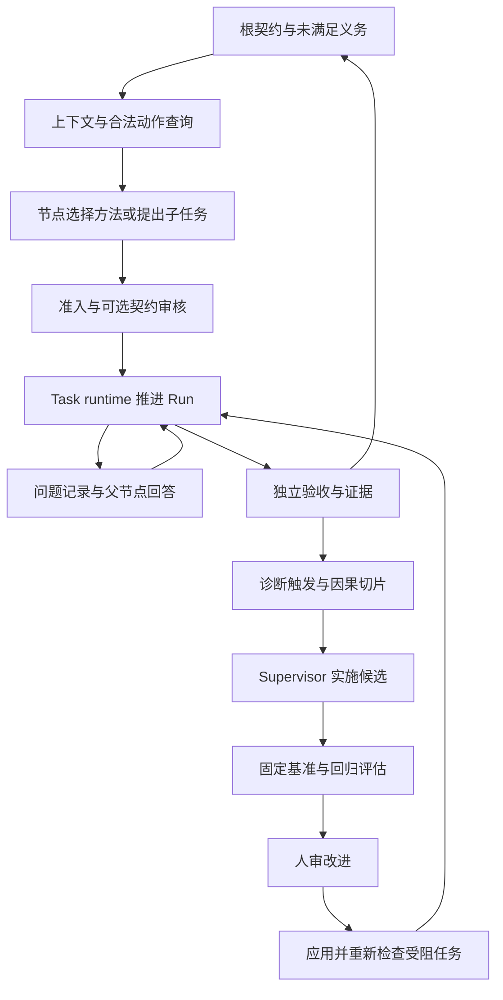

# 有目标的自由探索与受控自进化：架构实施指导

日期：2026-09-21。状态：架构决定与待建合同，不是已上线功能。基线 Singularity `9900959`，外层 harness `51b6e2f`；本地 DSH `0d1f50007f9bca3f52b06e1c3074fa14d5fb0720`。

本文细化 [主指南](singularity-harness-guide.md)的上下文、协作与 supervisor 主线；Task 结构及可选契约审核见 [Task 自主构造指导](task-contract-construction-guide.md)，建设顺序见 [计划](2026-09-20-vrtc-code-change-plan.md)。外部事实及固定来源见 [开源调研](2026-09-21-open-source-agent-patterns.md)，角色提示词合同见 [Prompt 指导](agent-prompt-contracts.md)。

## 1. 要达成的行为

给定根目标，节点知道自己的任务为什么有用、需要什么证据、有哪些约束；可选择工具、复用方法或构造子任务。信息不够时先查询可追溯上下文，再询问父节点。执行结果由 verifier 判定；有能力或机制缺口时，supervisor 沿执行与证据关系定位原因、实施候选、组织对照验证，人审核改进后系统应用并恢复受影响任务。

不把成功寄托于一段万能 system prompt，也不预先规定领域步骤。运行时负责结构、权限、资源与状态不变量；模型负责方法选择、任务构造、解释和候选实现。自由不是随意修改目标，进化不是绕开验证。

## 2. 现状审计

| 问题 | 当前已经有 | 当前还没有或存在断点 |
|---|---|---|
| 子节点全局观 | fresh session；TaskHandoff 的父目标、理由、决策/约束等字段；父 session 引用；worker contract 系统投影 | 实际 `buildHandoff` 调用主要填父目标、依赖证据、assumptions，决策/约束常为空；没有完整 root brief 和祖先决策投影 |
| 压缩后契约 | `contract-reinjection.ts` 复用 DSH system prompt projection，agent scope 隔离 | 动态上下文版本、决策变更通知、事实与摘要来源分离不完整 |
| 子询问父 | DSH 有 inbox/steer/followup、continuable send_message；worker 有 ask_user_question | Singularity spawn 直接走 agents.create，未注册 continuable activation；开放 send_message 不能自动得到子到父通道；缺 questionId/答复/等待协议 |
| 父节点可回答 | agent 会话可继续 | `decomposeAndRun` 等待整个 cascade；父模型卡在工具调用，子若同步等待父回答会形成循环等待 |
| 多轮任务执行 | Agent 会话、TaskRun 分离 | `awaitWorker` 以 whenIdle 触发后续验收，不能区分“等待澄清的 idle”和“提交验收的 idle” |
| Task 发现 | task_read 读当前任务；task_status 列整 store；capability_list 列 registry | task_read 没有任意 taskId drill-down；没有受限图切片、revision/cursor、合法动作和阻塞原因的结构化视图；不存在任务模板 catalog |
| 沿图 debug | task_review_pack 带当前任务的 reviews/父子摘要/相邻依赖；只读 task_review_agent 及 Diagnosis | 无自动 review 触发与跨任务因果遍历；reviewer prompt 限制“pack and nothing else”与读取更深证据的工具能力不协调 |
| 改进执行 | Evolution proposal/prepare/replay/gate/approval/apply/rollback；P1–P4 | 无 supervisor 自动候选工作流、真实来源全绑定、blocked 恢复；多目标执行器仍缺失 |
| 根目标 | Graph 创建调用 createRootTask；RootTaskSpec 提供默认 composite | 当前 objective 取 graph name，根 AC 默认只有子全通过；P4 有能力不等于入口已绑定真实用户目标和独立根判据 |
| Prompt 一致性 | root/worker 提示词在源码；工具按 grant 筛选 | root 仍写 L4/manual；worker 要求“make command exit 0”及直接问人；decomposable 一段同时写强制拆分与不适合则本地执行 |

主要源码：`task-runtime/src/{handoff,contract,orchestrate,index,capability}.ts`；`agent-runtime/src/{index,contract-reinjection,grants}.ts`；`agent-runtime/src/prompts/root.prompts.ts`；`agent-singularity/src/tools/{task-read,task-status,task-review-pack,review-agent}.ts`。

表中“没有”基于该提交源码，不据此推断具体运行 profile 已挂载哪些插件；实施前必须核对 profile composition 与工具实际可见集合。

## 3. 先固定的架构决定

| 决定 | 采用 | 代价与不采用项 |
|---|---|---|
| 上下文继承 | 结构化 handoff + 精简全局事实 + 引用按需读取 | 需维护来源/新鲜度；默认不 fork 全部父历史 |
| 父子问答 | 持久化问题/回答 + 非阻塞投递 + 可恢复等待 | 先改协调生命周期；不能用同步递归 RPC 或人类问答替代 |
| 调度 | 一个 Task runtime 拥有批次推进，初版子任务仍按依赖串行 | 只让父模型不被长工具调用占住，不顺手引入并行工作窃取 |
| Task 可用性 | runtime 给出可见性、准入诊断、owner、合法动作 | prompt 不自行猜状态；任务列表不是任意领取队列 |
| Supervisor | 按事件启动、有预算的诊断与候选会话；只读诊断和写候选分角色 | 无每节点常驻主管；最终决定不由候选作者自批 |
| 事实来源 | Task/Run/Evidence、Graph、DSH Session 分别拥有事实，按 id 联接 | 不将三棵图合成一棵，不复制 DSH Team task board |
| 进化单位 | 一项已定位失败、一份候选、一组固定评估、明确回滚 | 不在一次批次同时改 Skill、裁判、阈值再宣布通过 |

概念流程（目标设计）：



这不是固定任务 workflow：节点决定具体工作路径，图只规定信息、授权和结果怎样进入可信状态。

## 4. DSH 与开源机制怎样复用

下列 DSH 路径以 `thirdparty/deepseek-harness/` 为根，事实来自当前固定提交。

| 基础能力 | 一手实现 | Singularity 的接入方式 |
|---|---|---|
| 创建与恢复、独立会话 | `packages/core/agent/src/index.ts` 的 create/resume/setup | 保留 agent-runtime 为唯一 handle owner；setup 安装 preset/grant/contract；恢复沿用同一 sessionId |
| 动态系统投影 | `packages/core/system-prompt/`；`packages/core/agent-loop/src/runtime-context.ts` | 沿用 scoped section + interpolate:false；新增动态事实 section，不写第二套压缩引擎 |
| 非阻塞输入 | `packages/core/agent-loop/src/agent.ts` 的 steer/followup/inject | 接收端繁忙用下一 step，idle 可唤醒；inject 本身不唤醒，不能误作消息送达 |
| 持久 pending inbox | `packages/core/agent/src/types.ts` 的 agent/inbox/spliced | 问题正文仍进 DSH Session；Task 记录协议身份与状态；重启对账 inbox/history，不能只看内存 |
| 历史读取 | `packages/session-query/tool-session-query/README.md` | 复用 sessionQuery 检索与精确事件读取，加上 Singularity graph/task 可见域检查；同 cwd 不等于同 graph |
| scoped 工具/Skill/MCP | `agent-runtime/src/grants.ts`；DSH tools/skills | 按实际 grant 渲染动作；Skill catalog 可见性不等于工具权限，当前全局 catalog 仍可能存在 |
| 审批与人类澄清 | `packages/interaction/user-approval/`、`user-questions/` | 继续使用既有渠道，Task 提案/进化/外部决策各自记录关联，不写新聊天系统 |
| continuable subagent | `packages/subagent/subagent/src/continuation.ts` | 当且仅当实例由该 manager 管理才可直接复用 sendMessage；本轮不把现有节点冒充 activation |
| Team mailbox/task board | `packages/experimental/agent-team/src/mailbox.ts`、README | 借鉴 durable queued→target receipt 的去重规则；不挂载第二套 Task board/roster，扁平不可变 roster 不替代嵌套图 |

**生命周期选择**：近期保留当前 agents.create/resume 所有权，在 Singularity agent-runtime 增加任务域路由适配，直接用 DSH live Agent inbox 投递，不新增 agent loop。问题是 Task 域对象，其待处理索引与发送/回执采用 Task 事件，不创建通用 IM 服务。不能调用 subagent manager 私有 API，也不能维护两份 AgentHandle。未来迁移 continuable manager，必须先证明 preset/MCP/grant/geometry 发布和销毁顺序可保留；它不是本轮的隐含依赖。

外部借鉴的范围：LangGraph 的私有子状态与显式输入输出、可恢复操作的幂等；OpenHands 的独立 conversation 和原始 event/condensed view 分离；GEPA 的轨迹反馈驱动候选与评估分离。只借机制，不引入它们的运行时。OpenHands 的阻塞 delegate 不能解决这里的循环等待；AutoGen 已进入维护阶段，不选为新增核心依赖。GEPA 用于候选选择的 validation 集也不能等同最终未参与选择的 holdout。

## 5. 子节点获得全局观：ContextView

### 5.0 先保证传播的确实是用户目标

在进入业务执行前增加根目标 intake：root agent 从用户请求构造规范化根契约，包含 objective、范围/约束、mandatory AC 和独立顶层检查。机器校验后按 T2 相同开关语义进行可选契约审核；没有模板也能生成。根契约草案不是任务已接受，不允许 worker 消费未接受草案。

T2/T3 作为一个交付组先完成子批次协议；A0 再负责根入口适配，复用摘要绑定、批准后重检和恢复规则，并补根激活幂等测试。off 是运行策略，不是提前交付不完整审核模块的途径；A0 的 off/all 都须完成验收，不能静默降级 off。

为避免修改不可变历史，后续实现将 graph setup 与 root Task 激活分开：graph/root session 可以先存在，根任务只在契约接受后创建；不要先创建 graph-name 根任务再原地改 AC。旧图已有根任务继续按历史读取/完成，若目标改变创建新目标绑定/新 graph，不偷偷迁移已有任务。GraphRecord、rootTask binding、task_read 的“尚无业务根契约”状态需要同批更新。

根契约未知的语义可以向用户澄清，但日常拆分不依赖用户编写。只设“子任务都通过”不能验收一个新业务根目标；至少一个独立根判据要回答真实交付是否成立。本文不强迫所有根预先写 childEvidence 的未来索引，可沿 P4 的独立 command/实际 verifier 路径验收。未落实顶层判据前不得把子任务成功汇总宣称为整体成功。

### 5.1 三层内容

| 层 | 默认内容 | 来源/更新 |
|---|---|---|
| 不可丢的任务核心 | 自身完整 AC/constraints/assumptions、根目标与根硬约束、父目标、我的贡献/义务引用、当前 run 身份 | T1 契约、TaskHandoff；契约不可变，系统 section 投影 |
| 小型动态事实 | 当前相关决策及来源、已选能力摘要、直接依赖/下游接口状态、未答问题、合法动作、预算剩余的实际观测 | 指定 store revision 的投影；变化时更新，不每 step 写时间戳 |
| 按需细节 | 祖先契约、相关兄弟 evidence、决定原文、失败日志、父 session 具体 seq | 只读查询；读取动作与返回进入模型日志 |

“全局”是知道最终目标、硬边界、自己的贡献和依赖，不是看到所有会话。普通 worker 不默认收到无关兄弟历史、全库 Skill 正文、所有诊断。Supervisor 可在授权域内读取更宽切片，但也先摘要再展开。

`ContextView` 建设字段：viewVersion、viewId、sourceRevision、storeId/graphId/taskId/runId、rootTaskRef、ancestorRefs、contractRef、handoffRef、decisionRefs、dependencyEvidenceRefs、capabilityManifestRef、pendingQuestionRefs、allowedActions、omittedRefs。名称可贴合 T1 现有字段，语义不可遗漏。

所有摘要段落带 sourceRefs 和 authoritative/derived 标注；LM 摘要不覆盖原始记录。规范约束优先级：运行时权限/部署限制 → 已接受根契约 → 当前任务契约 → 已记录决定 → 临时回答/摘要。发现冲突需显式诊断/提问，不能静默选一条、改变契约或提升权限。

### 5.2 根与祖先定位

从 Task 的 parentTaskId 追到根，并以 GraphRecord/root binding 校验；不要使用“store 中第一个 depth=0”，因为 replay 也可能建立 parentless 任务。Session.parentSession 说明会话来源，不自动等于任务父子关系；reviewer/supervisor 节点可以有 session 但没有业务 TaskRun。

祖先决策只传 applicableTo 当前任务或依赖接口的记录。决定的最小数据是 decisionId、author、scope、text、sourceRefs、createdAt、supersedes；Task store 保存一次，handoff 保存引用和建立时的版本。新增决定不能改写已接受 AC；需要改题时回到契约修订。

### 5.3 上下文预算与可见域

核心契约不做静默截断；过大则准入明确拒绝或请求合理分解。外围信息使用可配置条目/字节预算、稳定排序和 omittedRefs；不得把缺省内容写成“不存在”。先用可测 UTF-8 上限，若沿用 DSH tokenizer 才报告 token 精确值，不自造估算器冒充计数。

scoped system section 只放可信 runtime 生成的结构与合同。引用的历史文本、父回答和网页是带来源的数据，不继承其“忽略规则”等指令权限。动态消息通过 DSH 已记录输入投递；不私改 session surface。压缩后能依据引用恢复，保持 root/task 关键约束。

当前 session query 的跨会话边界是 cwd 精确相同，Singularity 的 group/router 视图更窄。普通 worker 的跨会话查询改经域适配工具；若仍授予原始 session_event_read，它会绕过新图域筛选，因此同批调整 allow-list 与真实工具测试。该设计是模型工具边界，不声称能约束拥有共享 shell/文件系统权限的恶意进程。

## 6. Task 列表与“可用”的含义

三个目录不能混用：实例视图列正在进行/历史任务；模板视图（尚未建）列可选契约模式；capability_list 列能力实现。首版不建模板库，不增加 Task 搜索向量数据库。

扩展现有 task_read/task_status：task_read 可按授权 taskId 精读；task_status 支持 self/ancestors/neighborhood/subtree 的有界切片。建议结构化结果含 `revision, tasks[], dependencies[], diagnostics[], nextCursor`，文本 renderer 只投影结果，不独立决定状态。分页 cursor 绑定 revision，过期要求重读，禁止分页中混入不同快照却称一致。

每个任务显示 taskId、parentTaskId、objective、status、latestRunId、ownerSessionId、contractRef、blockingReasons、evidenceRefs、allowedActions。普通 worker 默认看自己、祖先目标与直接依赖摘要；跨 group 的隐藏成员只显示 router 端点或授权摘要，不能通过 taskId 猜测越界读取。现有 task_status 全树可见不是已经具备该隔离，需迁移测试说明行为变化。

运行时回答四个不同问题：

1. `visible`：这个调用者可读哪些事实？
2. `admissible`：一个新提案是否符合结构、能力、权限、预算约束？
3. `runnable`：已准入任务的依赖、审批、有效 owner/Run 是否已就绪？
4. `allowedActions`：当前调用者能查详情、提问、提出子任务、回复、提交验收或请求恢复中的哪些动作？

列表只是观察，实际动作必须重检 revision/owner/state。worker 不得因为任务 ready 就接管兄弟工作；初版由 runtime 分派，暂不实现分布式 claim/租约。成功 task 的证据可复用，不能把其历史实例直接改回 running。若无适用实例/模板，节点按 T1 提案，不把“列表空”当作任务不合法。

## 7. 父子澄清协议与非阻塞执行

### 7.1 必须先解除循环等待

当前链路是“父工具等待子 whenIdle → 子工具等待父回答”，DSH 的 steer 只能在父下一 step 生效，无法抢入尚未返回的工具执行。给子节点加 ask_parent 而不改父侧协调会死锁。

建设决定：把 `decomposeAndRun` 的“准入提交”与“批次推进”分开。Task runtime 保存一个批次的 child ids、依赖、执行进度；准入后立即返回 batchId/状态，runtime 在 Cordis effect 拥有的执行中推进。父 agent 得以继续收消息/答问。初版仍每批一次运行一个子任务，共享 checkout 不因父可响应而变成并行写入。

推进不是另建 workflow 引擎：沿用 runChildrenCascade 的验证/依赖规则，抽出可重入推进函数；事件 store 是真相，内存只缓存 handle 和待运行工作。出错必须记录并通知 owner，不能 fire-and-forget 吞异常。取消按 graph/batch/run 明确传播，卸载按 owner 顺序停止/flush。

A3 统一模块职责：Task runtime 对分解、提交、取消和恢复负责身份/状态重检、幂等与副作用交接，工具层只做输入转换和结果展示；A4 问答沿用同一合同。先计算合法迁移并持久化效果意图，再通过已有 agent-runtime/verifier 执行；恢复按稳定身份补缺失效果，不把内存 promise 当状态。普通执行、replay、恢复共用提交/验证/预算/取消规则，只允许调用场景显式不同；不得各复制一套状态分支。新增内部 helper 必须减少重复职责，不把每个事件包装成独立框架或插件。

共享工作区必须避免父子同时写：父进入 waiting_children 时，运行时工具执行闸只放行上下文读取、向直属父提问、回答子问题、root 的必要人类澄清、诊断请求、状态查询与受控取消；拒绝父的写/shell/再次分解等动作。不能只调整下一步工具 schemas，因为在途调用也需检查。并行独立工作必须另有产物范围与隔离合同，本票不开放。

派发与验收共用写入收敛边界：先持久化准入关闭状态，再排空已准入的写调用及其受管理后台进程，最后启动子批次或捕获产物身份并验证。分解可以立即返回 batchId，但排空完成前不能启动子节点。提交可以立即返回已记录，但排空完成前不能进入 verifier。复用现有工具/进程生命周期服务，不自造进程调度器；无法确认停止的写进程形成明确的不可验收诊断，禁止超时后假定已停止。恢复后同样先对账，不能仅因内存调用计数为零就验证。该边界覆盖受管理执行，不声称隔离共享文件系统上的任意外部进程。

“批次内串行”不足以排除跨批次冲突。A3 在现有工作区/运行所有者中记录唯一写入归属，以规范化工作区身份覆盖共享该 checkout 的批次和根任务；冲突请求在副作用前返回结构化 busy，不建立隐含的无限等待队列。父委派前排空并转交归属，子完成后经 runtime 收回；取消/重启须对账受管理进程，不能抢走仍可能写入者的归属。验证器执行也占有该工作区的排他执行期，避免测试写文件与其他 Run 冲突。候选与基线各用独立工作区。首版归属由已有单进程 runtime 管理，部署入口必须拒绝无法保证独占的多个管理进程接管同一工作区；不把进程内 Map 宣称跨进程锁。实现无法检测某种入口时，该入口不能标为支持。这是 A3 的完整运行合同，不是另一个提前运行的图版本。

### 7.2 分开 Agent idle 与任务完成

保留 Task 的结果状态；新 Run 主相位（建议 executionPhase）为 active、waiting_children、submitted，另以 pendingQuestionIds/blockingQuestionIds 记录正交的问答等待。active 且有阻塞问题时，对外显示 waiting_answer；waiting_children 同时可有阻塞问题，不能覆盖原 batchId 或把主相位改成 active。waiting 不是 PASS/FAIL，也不重用 capability blocked 原因。事件与 reducer 变更需按持久化规则记录。

新增提交验收动作（工作名 task_submit_result）：worker 提交 artifact refs 与证据引用，runtime 进入 submitted→verifying，verifier 决定结果。task_verify 仍只是自检。session idle 无提交时只能是等待或异常停顿，不能直接做“完成”证据；祖先 waiting_children 的 idle 不触发父验收。子全部终态之后仍必须执行独立父 AC。

上游 agent/turn-stopping、pre-step 和原生 inbox 用于抑制空转/接收唤醒，不修改 agent-loop。当前 DSH 在 pre-step hook 之前已 claim 并持久化移除 inbox 项；不得用“正在等待”一律 reject，否则会吞掉尚未交给模型的问答。有效协调输入必须放行；claim 后 reject/crash 时从未处理领域记录重新投影或恢复投递，保留相同消息身份。首版 active idle 无提交且无阻塞问题时保持非终态并记录可观察的未提交诊断；允许一次配置内提醒，后续无进展走预算停止，不能无限唤醒。旧终态记录原样读取，不把旧 session idle 重新解释为新提交事件。

最小迁移矩阵（事件名为工作名，实施前与 TaskEvent 类型统一）：

| 当前相位 | 触发及前提 | 下一状态与效果 |
|---|---|---|
| active 且无阻塞问题 | 有效分解批次原子提交 | waiting_children；拥有 batchId；父写入收敛后只启动一个符合依赖的子节点 |
| active 或 waiting_children | 阻塞性问题已持久化 | 主相位不变，加入 blockingQuestionIds；保留 batch，停止受阻动作，不触发 verifier |
| 有阻塞问题的非终态 | 有效且适用的解决性回答 | 只移除对应阻塞；同一 run/session 可处理回答，其余阻塞仍有效；waiting_children 的写闸保持 |
| active 且无阻塞问题 | 有效 task_submit_result | submitted；关闭写入准入，排空后捕获身份并验证，走既有终态 |
| waiting_children | 全部子节点终态且无未处理协调事件/阻塞问题 | 由 runtime 进入 submitted，写入收敛后执行父验收；父 agent 无需第二次自述完成 |
| 任意非终态 | graph 取消/硬超时/不可恢复基础设施失败 | 按原因走 cancelled/failed，取消未答问题和后续派发 |
| 任意终态 | 迟到问题/回答/提交 | 拒绝执行效果，保留诊断；不能复活原 Run |

历史非终态 Run 缺相位时不能默认认定 active 并自动重跑；恢复入口先从旧事件确认可安全继续的路径，否则显示 needs-recovery 诊断，不新增伪造终态。迁移模式不得绕过原预算、重复已产生的外部副作用。

### 7.3 最小问答对象

```text
TaskQuestion:
  questionId, requestKey, storeId, fromTaskId, fromRunId,
  toParentTaskId, parentRunId, contractRef, contextRevision,
  question, blockingReason, consultedRefs, suggestedOptions?,
  status: open | answered | cancelled | expired
TaskAnswer:
  questionId, answerId, authorSessionId, text, sourceRefs,
  kind: clarification | decision | unresolved | requires_contract_change
```

身份从已绑定 run/Task parent 推导，节点不传任意 recipientId。首版只支持直属父子；跨组通过 router，兄弟协作由父路由。问答是消息/Task 事件，不增加 Graph spawn/handoff 边。

工具工作名为 task_ask_parent、task_answer；schema 在相关角色实现后才暴露。ask 先落 open 问题、再尝试消息投递，立即返回 questionId/delivery 状态，不等待答案。问题有 Task 事实记录与目标 Session 入箱回执，两者之间以稳定 questionId 对账，保证重试不双投递；不能承诺跨进程 exactly-once。

投递使用明确的 agent-message 来源，sender 由 live Agent 与 run binding 推导，不复用目前面向用户的 agentRuntime.prompt 来冒充人类输入。投递回执只有目标 session 的 inbox/history 持久保存相同消息身份后才能记 delivered；工具内存返回、显示过弹窗、agent 已在线都不算回执。消息内容保存一份完整快照并按其身份投递，Task 事件与 Session 事件记录关联。

必须区分 transport delivered、待处理领域事实和模型已消费：入箱/claim 都不证明模型见过。未答问题及待消费回答继续进入 ContextView；以可追溯的模型 step 输入确认消费，领域处理结果另由幂等工具动作确认。若公开事件无法证明消费，就保留待处理引用并允许重放，不伪造 consumed。恢复只补缺失效果，重放不重开问题或重复执行已经落账的回答；不能把所有 delivered 消息从恢复索引删除。

阻塞性问题加入该 Run 的 blockingQuestionIds，worker 停止受阻执行并等待唤醒；不阻塞父 loop、不轮询。已有子批次时仍保留 waiting_children，可处理协调消息并逐级提问。非阻塞问题仅在确有无依赖工作时允许继续。父从全局 brief/决定/证据回答，无足够依据明确说明未知，可逐级询问，不默认找人。涉及用户目标/新增权限/残余风险，root 使用已有 human 工具。

answer 校验真实父身份、question 状态、对应 run 和契约；回答进入两端可追溯历史。clarification/decision 是父显式声明可解决问题的回答，仅在绑定仍适用时置 answered 并解除该项阻塞；runtime 不声称证明自然语言答案正确。unresolved 保持 open，可追加后续解决性回答；requires_contract_change 保持阻塞，转契约处置，不能当作普通回答放行。所有阻塞项解除后才允许原主相位下的执行动作，不能收到一个答案就恢复 active。父 Run/子 Run 已终态、问题取消、契约修订则拒绝迟到回答的执行效果，保留审计。重复相同 answerId 幂等，已解决问题的冲突答案拒绝；parent 不可用记录 unavailable 并等待恢复/期限，不隐式新建替代父节点。

回答是信息，不是权限或验收。需要改 AC 时标 requires_contract_change，该子任务不能据此私改契约继续。可复用决定经父显式记录 Decision 后进入后续 ContextView；普通聊天不自动成为全局决策。

### 7.4 时间、循环与故障

每 run 的提问数、同一问题无进展次数、未答数量有外置限额；问题重复按 requestKey/idempotency 管，不能只用字符串相似度静默合并。未回答不是失败答案。首版 wallTime 按原始 startedAt 继续计入等待，不重启计时；超限取消协调并保留问题，未来主动执行时间与等待时间拆账另立票。

A3 同时建立根目标预算归属：子任务、重试、诊断、候选和评估各有明细但共用根总额，replay 的 parentless Task 通过明确的资助根引用记账，不因 Task 无父亲获得新预算。独立评估请求必须有自己的显式预算 owner。时间从根接受时计，Run 期限不得晚于根期限；次数在准入时按稳定操作 id 预留/记账，崩溃恢复不重复计数，也不重置额度。A5/S2-R/S3/S4-E 接入该入口，不能新增各自独立的总预算。

A3 先使用现有 root binding 和可追溯的创建/接受事件确定预算 owner；A0 后续只接入真实根契约接受事件，不改变预算语义。旧记录缺少可确定起点时走明确恢复诊断，不用重启时间伪造新预算，也不要求 A3 依赖尚未实现的 A0。

硬限制先覆盖可观察的截止时间、Run/实验启动次数、递归深度和并发写入数；达到上限拒绝新副作用并取消受影响执行。token/工具费用只有在实际 provider/工具入口提供运行中计数时才可标硬限制，事后观测必须标软统计，unknown 不记零。调用方要求无法执行的硬限制时明确拒绝启动，不悄悄降为软统计。

进展记录引用实际事实：新增且校验有效的证据、解除阻塞、满足义务，或带实验结果的假设排除。自然语言“有进展”、重复同一失败调用、重复创建同目标任务不自动清零 noProgressRounds。无需通用语义相似度判定；以稳定义务/证据/问题身份和有界诊断计数推进。已知等待不触发无进展重试，但仍受根截止时间约束；达到限额保留诊断并停止，A5 完成前不调用不存在的主管入口。

非阻塞批次的工具 signal 只控制请求准入；工具正常返回不取消已接受的批次。批次之后由 graph/run 生命周期 signal 拥有，用户停止图或运行超时才取消。该 signal 转移须有测试，不能让“工具调用结束”意外杀掉所有子节点。

## 8. Supervisor 沿图 debug 的办法

### 8.1 观察什么图

用 Task DAG 找目标与依赖，用 TaskRun 找一次实际实现和 session，用 Evidence/Artifact 找判断对象，用 Graph 找可见 agent/职责端点；Session lineage 用于追溯上下文来源。不得用 canvas 坐标、最近聊天顺序或“最深红节点”推断根因。

同一个失败下游可能只是上游失败的传播。诊断记录区分 symptomTaskIds、suspectedOrigin、supportingRefs、counterEvidenceRefs、unknowns、nextExperiment、candidateTarget。事实与假设分列，置信度来自证据说明，不输出虚构百分比。

### 8.2 有预算的因果遍历

1. 捕获触发时 store revision、目标 task/run/AC、输入产物与 verifier 身份，生成现有 review pack 的扩展版本。
2. 对目标失败 AC 读取原始结果/log refs；判别执行失败、裁判 UNKNOWN、依赖缺口、契约不清、上下文遗漏、预算停止。
3. 沿 blockedBy、dependsOn、artifact provenance 回溯直接原因；沿 parentTask/childEvidence 检查父子接口与覆盖。每条边要求原始引用，不以自然语言自述造因果边。
4. 只对待验证假设读取相关 Session seq、工具结果、handoff 和决定版本；遇到外部 root 或权限边界停止并请求可见证据。
5. 选择一条最小反例/对照实验，写出可证伪预测；缺证据返回 unknown 和需要获取的证据，不能靠更多摘要假装已定位。
6. 若有充分失败定位，提出一个候选目标与适用条件；与代表性成功邻居比较，防止仅优化失败样本而破坏原行为。

遍历预算包括最大邻居数、trace 字节数、模型调用数、实验次数和总成本。维护 visited 的 (taskId,runId,edgeKind)，截断给 frontierRefs。预算耗尽保留部分结论与未知项，不将其变成“无问题”。默认不扫整个历史库。

### 8.3 触发与角色

Task runtime 的终态 ReviewRecord、CapabilityGap/Obligation、反复无进展或 verifier unknown 为候选触发源。先按 `(storeId, taskId, runId, failureKind, evidenceRevision)` 去重，再按父级/根预算合并同一原因；只排一个 incident 工作项，更新源证据追加到同一事件链。不为每个事件常驻一个 supervisor。

事件去重与因果合并不同：前者使用上述精确键；后者只在多个失败明确引用同一个上游 run/evidence 或同一个 unresolved obligation 时合并，保存所有 symptom refs。仅文字相似不得机器认定同一根因；没有因果引用时可分别记录、受预算限制后由诊断提出关联。

保留现有 reviewer 只读工具集。它产生 Diagnosis/实验建议，不写生产、不修改其正在评价的判据。Supervisor orchestrator 消费 Diagnosis，给一个有范围的候选实现节点分配 sandbox 写权限；候选构建者、验证执行器、人类晋升决定分别有记录。逻辑角色可复用 preset/工具组合，不要求新增三个常驻服务或三种模型。

当前 `task_review_agent` 有一次/每 store 默认预算及 escalation 判定，不等于持续 debug 服务；新预算应显式替换为 incident 级计数和根总额，不静默绕过旧限额。现有 reviewer prompt 需允许沿可授权引用继续读取，不再要求 only pack；新读入证据也必须进入 Diagnosis refs。

### 8.4 从建议到可用改进

Incident → Diagnosis → Candidate Task → EvolutionProposal → sandbox → 固定评估 → 人审 → apply → 依赖重检/恢复。链接保存 id，不复制日志/报告正文。拒绝保留 candidate/history；按预算修订新候选，不改旧候选摘要。

A6 交付使用已完整验收的 skill/capability 实现路径，复用 T1、S1-C 和 P2/P3；没有独立的临时试点版本。新工具、verifier、任务模板及 runtime policy 逐个补目标执行器和评估，未支持类型在查询与执行入口一致说明并拒绝晋升；不能接受半成品后要求人补写。

评估集分为失败复现集、既有回归集、开发验证集和未参与选择的最终保留集。不断查看并优化同一 holdout 就使其成为开发验证集；对未见泛化的宣称需新保留集。Skill 看目标修复+不退化+成本；Verifier 看负样本漏检和变异检出；Task 模板不能通过降低难度/删 AC 获得改进。

S4-E 在主管自动候选执行前完成：冻结任务/输入快照、裁判版本、模型/工具配置、预算、重复次数和比较规则，基线与候选在独立工作区从相同初始内容重新执行。当前 replay 以历史 champion 对比新候选的机制只提供历史参考，不能作为环境变化后的因果改进证据。报告必须关联真实 Run/Evidence，不只校验字段自洽；不可比、证据不足或未知费用保留明确状态。修复晋升要求声明的改善成立并满足回归闸，两侧同失败不算修复。具体验收以建设计划 S4-E 为准。

任务内决定只影响有来源的当前上下文，不自动晋升为共享 Skill。共享候选需明确适用条件，并在原失败输入之外验证；保留失败候选与成本，不只记录赢家。S1-C 保证 Run 实际加载固定内容；apply 不热替换在途 Run。S2-R 改用新能力时创建有 lineage 的新 Run；已成功兄弟仅在输入与证据仍适用时复用，失效后保留历史并显式重新执行受影响部分。

人审材料由系统聚合候选 diff、源 Diagnosis、固定基线、评估/费用、已知限制、回滚与受影响任务，不让人去补实现。现有 decide/apply 两次人审仍保持；将来可绑定批准摘要合并为一次，但不得在此票偷偷改变授权。

通过后系统重检原义务是否满足、资源是否可用、目标契约是否仍有效，再按 S2-R 创建或继续合法 Run。Task 的历史失败和证据不覆盖；不依赖父再次分解已落库批次。不是每次失败都能自动修复，预算/权限/裁判不可用时保留缺口并上报。

## 9. 运行时与 Prompt 的分工

运行时生成实际工具集合和 allowedActions，提示词讲如何使用它们。使用 [Prompt 指导](agent-prompt-contracts.md)中的角色文本和 schema 合同；不把未来工具名提前写进已部署 prompt。

Prompt 按角色政策（稳定）、不可变契约、当前上下文投影、工具 schemas 分层。事实渲染不执行模板插值。promptVersion/template hash 和 sourceRevision 可追溯；快照测试必须比对真实装配后的系统文本与工具集，而非只测字符串 helper。

尤其要改正 root 中“L4 stays manual”、worker 中“make command exit 0”和“模糊就问人”的当前措辞：实现应满足语义、保留受保护判据，先查上下文/问父，L4 是例外决策。decomposable 意图允许父做规划委派，但必须明确是父指定协调任务还是缺能力暂未可执行，不能同一段同时命令“必须拆”与“不合适就自己做”。

## 10. 分批建设合同

派发严格遵守 [建设计划](2026-09-20-vrtc-code-change-plan.md)文首唯一顺序与交付组，每次读取 [公共执行合同](execution-prompts/README.md)，更新主 guide、计划及本文当前状态。A 编号仍未实现。下表只定义责任与验收，不另构成可跳过前置的路线。

| 票 | 前置与落点 | 必交付与确定性验收 |
|---|---|---|
| A0 真实根契约入口 | T1、S1-V 切片 2、T2/T3 组；graphs/createRootTask、root 角色 | setup 不消费根分解；无契约时 task_read 返回未激活；graph name 不冒充目标；新根有独立 AC；子全通过但根错误仍拒绝；off/all 与激活崩溃恢复完整；拒绝草案零派发；旧图不改历史 |
| A1 全局上下文投影 | A0/A2、S1-C；handoff/contract、scoped prompt | 三层递归能读 root/贡献/来源决定/依赖；复用 A2 授权读取；无关正文不默认注入；压缩/重启可恢复；超预算有引用与诊断；多个 depth=0/replay 不串根；文本不变权限 |
| A2 任务导航与合法动作 | A0/A3、S1-C；task_read/status、权限域 | 自己/祖先/邻域分页与状态准确；未激活/等待状态不误报；跨 graph/隐藏组拒绝；不同 cwd 失败明确；ready 不允许接管；陈旧 revision 重检；空模板仍能生成；工具显示与准入相同合同 |
| A3 非阻塞批次与协调相位 | T1、S1-V 切片 2、S1-C；Task runtime/reducer、agent-runtime | 分解立即返回且父可继续；waiting idle 不验收；显式提交/父独立验收；依赖串行、取消/恢复/卸载完整；提交/派发去重；迟到写入、跨批次/跨根工作区冲突被阻挡；普通/replay 同守状态规则；根预算不因新 Run/重启重置，无进展停止 |
| A4 父子问题/回答 | A1–A3；TaskQuestion、消息适配、scoped 工具 | 真实 DSH loop 父子问答完成，无同步死锁；孙问子、子问根后 batch 与写闸保留；一个答案不清空其他阻塞，unresolved/改契约不放行；重复/迟到/伪造身份/跨组/缺父拒绝；ask 先落账、无回复不成功；入箱及 claim 后 reject/crash 可恢复且不重复领域副作用；问题不新增 graph 边；闭包缺口不自动提权 |
| A5 因果诊断与 supervisor 触发 | A1/A2/A4、S4-E；与 S2-E 同组 | 一个上游错误仅一次 incident；引用真实边与原始证据；伪造 ref 拒绝；裁判/任务错误分开；根预算与 frontier；候选交接落账但自动执行未开放；重启不重复通知/主管任务 |
| A6 自主改进和恢复 | A5/S2-E 组、S4-E；与 S2-R/S3 同组 | 缺能力时自主组合，另例实现候选并独立验证；坏候选拒绝、正确候选人审 apply 后恢复；拒绝/重启/预算停止/回滚完整；有效兄弟证据复用、失效证据拒绝；新能力用新 Run，零人工补写 Skill |

所有前置按建设计划的完成闸检查。T2/T3、A5/S2-E、A6/S2-R/S3 分别作为交付组，不留下需下一组补齐的已承诺行为。新增问答等后续能力未完成时不暴露其工具或假装可用，已交付的执行/取消/恢复不能依赖未来工具。模块可分内部提交，不能把半成品提交标成完成。

A3 是本组风险最高的基础改动，应先提交事件/状态迁移矩阵和受控模型 fixture，评审合同后实现；这里的“评审”是后续工程的交付物，不要求人替 agent 设计所有细节。代码需要的审批仍按现有用户授权，不额外设开发许可流程。

## 11. 架构是否有效，怎样测量

协议正确性与模型效果分别验收。协议用真实 store/DSH loop 配合 scripted provider，断言状态、权限、消息、重复副作用；模型实验固定目标集/环境/模型/预算，对比有无 root brief/澄清路径的目标成功率、父目标违背率、有效澄清率、token/工具成本和无进展次数。不能只因 token 下降或模型会复述 prompt 就宣布效果更好。

首个领域选择便宜确定性的接口组合/小型工程目标，至少包含：子全通过但父接口不一致、缺一个关键决定、父正等待子时子提问、上游失败传播到两个下游、坏 verifier、拒绝候选后重新修订。确定性 fixture 通过不等同真实模型实验；结果在计划中分别记录。

仍有边界：自然语言目标完整性、prompt 注入下的语义鲁棒性、跨进程 exactly-once、恶意共享文件系统写入、所有目标可自动修复均不作保证。架构降低错误传播并使其可诊断，不以“自由探索”要求无限预算或承诺所有问题有解。
